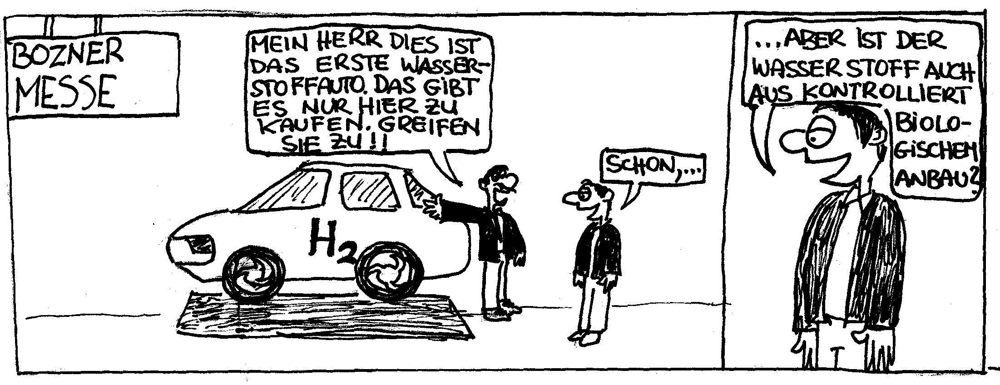

Wasserstoff ist ein Brennstoff, der in der Natur praktisch nicht vorkommt. Er muss unter hohem Energieaufwand gewonnen werden. Geschieht dies durch [Elektrolyse](http://de.wikipedia.org/wiki/Wasserelektrolyse), dann benötigt man 100 kWh elektrischer Energie um 70 kWh im Wasserstoff gespeicherter Energie zu erhalten. Dieser Wasserstoff muss, damit er gespeichert werden kann, komprimiert werden. Dafür gehen etwa 8 kWh verloren, es verbleiben also 62 kWh im Wasserstoff gespeicherter Energie. Diese ist jedoch nicht direkt nutzbar. Hierzu muss der Wasserstoff entweder in einem Motor verbrannt oder in einer [Brennstoffzelle](http://de.wikipedia.org/wiki/Brennstoffzelle) in elektrische Energie umgewandelt werden. Im letzteren, günstigeren Fall gehen dabei noch einmal etwa 25 kWh (40%) verloren. Der Rest von 37 kWh steht dann in Form von elektrischer Energie am Motor zur Verfügung. Der Gesamtwiderstand der Zwischenspeicherung im Wasserstoff beträgt somit etwa 37% also die Hälfte des Werts, den man in einem [Pumpspeicherkraftwerk](http://de.wikipedia.org/wiki/Pumpspeicherkraftwerk#Wirkungsgrad) erreicht.

Wenn man weiters bedenkt, dass nach wie vor 2/3 der elektrischen Energie in Wärmekraftwerken erzeugt werden, welche ihrerseits nur ein Drittel der eingesetzten Primärenergie nutzen, dann ergibt sich, dass beim Einsatz von Wasserstoff als Zwischenspeicher bestenfalls ein Sechstel der eingesetzten Primärenergie als nutzbare Endenergie zur Verfügung steht. Das ist für eine nachhaltige Technologie entschieden zu wenig.
