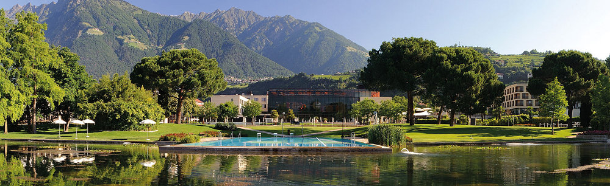
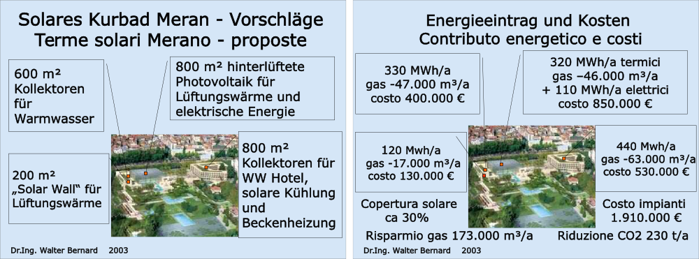

Im Frühjahr 2003, also noch bevor mit dem Bau von Schwimmhalle, Kurabteilung und Hotel der neuen Therme Meran begonnen wurde, habe ich in einem öffentlichen Vortrag eine Reihe von Maßnahmen für eine "Solare Therme" vorgeschlagen.

Durch die Maßnahmen sollte der Bedarf an nicht erneuerbarer Energie der Therme verringert werden, was neben den positiven Auswirkungen für die Umwelt auch eine bedeutende Verringerung der Betriebskosten bedeutet hätte. 

Im Vorschlag waren insgesamt vier Solar-Kollektorfelder vorgesehen.

1. Warmwasserwasserkollektoren (600 m²) auf den Dächern der Kurabteilung für die Brauchwassererwärmung

2. Luftkollektoren (200 m²) an der Südwand der Kurabteilung für den Lüftungswärmebedarf

3. hinterlüftete Photovoltaikkollektoren (800 m²) auf dem Glasdach der Schwimmhalle für den Lüftungswärmebedarf und zur Gewinnung elektrischer Energie

4. Warmwasserkollektoren (800 m²) auf dem Dach des Kurhotels für die Brauchwassererwärmung und für solare Kühlung.

Die vorgeschlagenen Anlagen hätten es ermöglicht, 30% des Energiebedarfs der Therme mit Solarenergie zu decken. Dabei hätten die erforderlichen Mehrkosten von 2 Milionen Euro lediglich etwa 2% der Bausumme betragen.

Im Jahr 2014 betrugen die Energiekosten der Therme ca. 1,2 Milionen Euro. Das heißt, dass sich die Investitonskosten für die vorgeschlagenen Solaranlagen in 5 bis 6 Jahren amortisiert hätten und die Therme nun schon seit Jahren etwa 400.000 Euro pro Jahr an Betriebskosten sparen könnte.

Leider haben weder unsere Verwalter noch die mit der Planung beauftragten Techniker meine Vorschläge wirklich ernst genommen. Schade.

