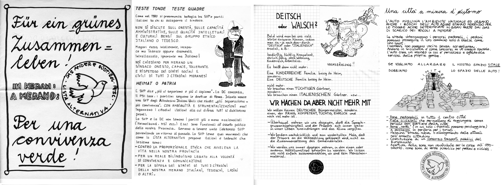

Im Jahr 1985 sind wir als **"Alternative Liste fürs andere Südtirol"** zu den Kommunalwahlen angetreten. Wir waren eine Gruppe von mehrheitlich jungen Leuten aus beiden Sprachgruppen, die sich mit Begeisterung engagiert haben.

Zunächst wurde das Wahlprogramm gemeinsam abgesprochen. Dann haben einige der KandidatInnen die genehmigten Texte in solider Handarbeit zu Papier gebracht. 

Entstanden ist ein kleines Heft, das vervielfältigt und verteilt wurde.

Aus heutiger Sicht finde ich nicht nur diese Vorgangsweise interessant, sondern besonders auch die Tatsache, dass viele Inhalte noch genau so aktuell sind wie vor 30 Jahren. 

Hier einige Beispiele.

Unter dem Titel ___"Für eine autofeindliche Stadt"___ stehen unter anderem die Forderungen:  
* *Ausbau der Nahverkehrsmittel, Schaffung eines Burggräfler Verkehrsverbundes*  
* *Öffnung der Randzone des Pferderennplatzes für Fußgänger und Radler*

Unter dem Titel ***"Jugend: Nix Arbeit - nix Spass"*** finden sich die Vorschläge:  
* *Wir unterstützen die Bemühungen der kirchlichen Organisationen um einen Jugendtreff. Unser Ziel bleibt aber ein öffentlich getragenes Jugendzentrum für alle, die es besuchen wollen.*  
* *Die Jugendarbeitslosigkeit im Meraner Raum ist seit 1980 um 180% gestiegen. Wir haben bereits vorgeschlagen, eine Jugendinformationszentrale (nicht nur für Arbeitsfragen) einzurichten. Auch sollte die Gemeinde alternative Arbeitsprojekte unterstützen.*

Unter dem Titel ***"Meran - Europa - Welt"*** steht unter anderem:  
* *Schließen wir Partnerschaft mit einer Stadt im Osten. Schicken wir ruhig auch unsere Musikkapelle hin.*  
* *Gehen wir mit unserem Stückchen Welt sparsam um - aber auch mit den Stückchen der anderen.*  

Für diejenigen die sich noch genauer über dieses historische Wahlprogrogramm informieren und/oder wissen wollen, wer damals die KandidatInnen waren gibt es [das ganze Programm als pdf](../../dosieroj/prog85.pdf).
