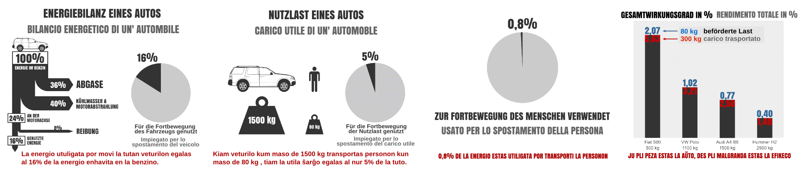

Unter den Arbeiten, welche unsere Schüler für das Projekt  ["Climobile"](/climobile/) erstellt haben, befindet sich auch eine Präsentation in welcher u.a. erklärt wird, wie groß der [Wirkungsgrad](https://de.wikipedia.org/wiki/Wirkungsgrad) eines Autos ist. In verschiedenen  [Quellen](http://www.greengear.de/notwendigkeit-verbrennungsmotor/) kann man nachlesen, dass der Wirkungsgrad eines Autos mit Benzinmotor etwa 16% beträgt. 

Dieser Wert brücksichtigt aber nur die Energieverluste im Motor und in den Übertragungselementen. Es wird dabei vernachlässigt, dass der Großteil der verbliebenen Energie nicht für die Beförderung der Nutzlast (Personen oder Waren), sondern für die Beförderung des Autos selbst benötigt wird.

Wenn zum Beispiel in einem Auto mit einer Masse von 1500 kg nur eine Person mit 80 kg Masse fährt, dann macht die Nutzlast nur 5% der beförderten Gesamtlast aus (80kg/1580kg=0,05=5%). Daraus folgt, dass nur 5% von den 16% welche für die Fortbewegung zur Verfügung stehen, Nutzlast befördern. Der Gesamtwirkungsgrad sinkt somit auf 0,05x16%=0,8%.  

###Nur etwa 1% der im Benzin enthaltenen Energie wird für den Transport der Nutzlast verwendet.###

Dieser Wert ist klarerweise um so kleiner, je größer die Masse des Autos ist. 

Trotzdem hat das mittlere Eigengewicht der Autos in den letzten 30 Jahren um etwa 60% zugenommen und beträgt jetzt in  [vielen Ländern](http://www.bfe.admin.ch/energie/00588/00589/00644/index.html?lang=de&msg-id=26779) etwa 1500 kg.

So eine Entwicklung ist zweifellos nicht nachhaltig.

**Die ganze Präsentation kann [hier](../../dosieroj/climobile_final.pdf) heruntergeladen werden**

