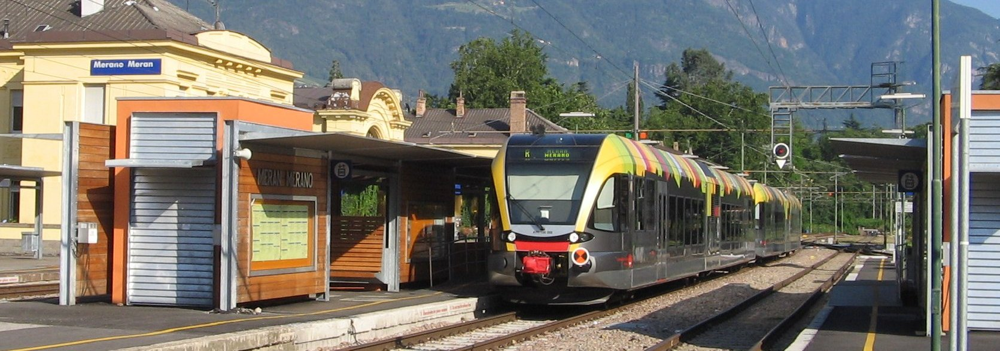
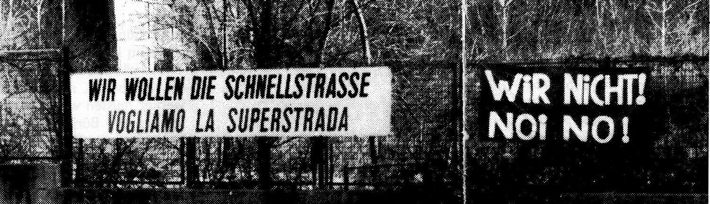

In den späten achziger Jahren des vorigen Jahrhunderts habe ich zu jenen gehört, welche sich gegen den Bau einer vierspurigen Schnellstraße zwischen Bozen und Meran ausgesprochen haben und welche jetzt abwertend als die "alternativen Verhinderer" bezeichnet werden. 

Dabei wird vergessen, dass wir schon damals nicht hauptsächlich verhindern, sondern viel mehr ein besseres Projekt voranbringen wollten. Es war uns durchaus bewusst, dass es notwendig war, die Dörfer entlang der alten Straße vom Durchzugsverkehr zu befreien. Es war uns aber auch klar, dass der Bau einer vierspurigen Straße eine Zunahme des Autoverkehrs auf der Strecke zur Folge haben würde. Unsere Forderung lautete deshalb:

###Zwei Spuren - zwei Schienen### 

Durch den Bau einer zweispurigen Straße auf dem rechten Etschufer sollten die Dörfer entlastet werden, und durch die gleichzeitig durchgeführte Verdoppelung und Modernisierung der Eisenbahnlinie, sollte  immer mehr Verkehr von der Straße auf die Schiene gebracht werden.  

Heute, nach 30 Jahren stellt sich heraus, dass wir mit unseren Befürchtungen richtig gelegen sind. Der flüssige Verkehr auf der Schnellstraße führt dazu, dass immer mehr Fahrzeuge die Stadtstraßen belasten und dort  im Stau stecken. Andererseits ist die Eisenbahn wegen der Verspätungen durch die Engpässe auf der einspurigen Strecke keine wirklich attraktive Alternative.

Das hat nun auch die Landesregierung erkannt, die den Ausbau der Bahnlinie Bozen-Meran in ihrem Beschluss vom 10.02.2015 als ["Infrastrukturprojekt von strategischer Bedeutung"](http://www.gemeinde.meran.bz.it/de/aktuelles/285.asp?aktuelles_action=4&aktuelles_article_id=486097) eingestuft hat. Leider hat sie für die Realisierung dieses insgesamt etwa 90 Millionen Euro teuren Projekts (40 Millionen für die Begradigung und Anpassung der Bahnlinie und 50 Millionen für eine dreispurige Einfahrt im Tunnel in Bozen) weder einen Zeitplan noch eine Finanzierung vorgesehen. 

Auch auf die Gefahr hin, wieder als "alternativer Verhinderer" zu gelten, würde ich der Landesregierung folgenden Vorschlag machen. 

###Verzichten sie auf den bereits genehmigten Tunnel der Nord-Westumfahrung in Meran und realisieren sie mit dem gesparten Geld umgehend sowohl den Ausbau der Bahnlinie nach Bozen als auch die öffentlichen Verbindungen zwischen Meran, Dorf Tirol und Schenna.###

Das wäre ein wichtiger Beitrag zur Verbesserung der Verkehrssituation, welcher im Einklang mit einer nachhaltigen Entwicklung steht.

**Einen Ausschnitt zum Thema aus der Wochenzeitung FF 5/89 gibt es [hier](../../bildoj/meboff-89.jpg).**

