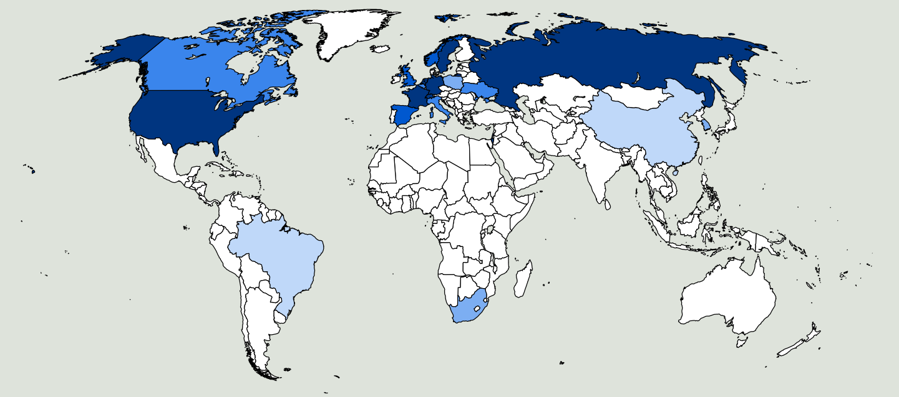

In den späten 1970-er Jahren habe ich als junger Ingenieur in einer Seilbahnfabrik in Sterzing gearbeitet. Die Tätigkeit an sich war sehr interessant, ich konnte mein Wissen anwenden und Neues dazu lernen. Trotzdem habe ich mich ständig nach einem  Arbeitsplatz umgesehen, der näher bei meiner Heimatstadt Meran war. Als ich in einer Zeitung eine Anzeige gesehen habe, mit welcher die Firma IVECO in Bozen einen Maschinenbauingenieur gesucht hat, habe ich mich gleich beworben.  Ich bin zu einem Eignungstest eingeladen worden und habe mit dem Chefingenieur ein Aufnahmegespräch geführt. Dann hat man mir die Werkhallen und einige Produktionabläufe gezeigt. Dabei haben ich festgestellt, dass im Bozner Betrieb nicht, wie ich gedacht hatte, Lastwagen hergestellt wurden, sondern gepanzerte Fahrzeuge. Das hat mir nicht gefallen. Nach etwa einer Woche hat der Chefingenieur mich angerufen und mir mitgeteilt, dass der Betrieb bereit war mich einzustellen. Ich habe ihm aber gesagt, dass die Arbeit mich nicht mehr interessieren würde, weil ich nicht an der Produktion von Waffen beteiligt sein wollte. Denn schon damals war ich der Überzeugung: 

<b>Wer die Waffen baut ist mitschuldig wenn sie töten</b>

 <small>Die zwanzig wichtigsten waffenexportierenden Länder</small>  
In der obigen Karte sind die [zwanzig wichtigsten waffenexportierenden Länder](http://diepresse.com/home/wirtschaft/international/717003/Die-20-grossten-Waffenexporteure-der-Welt) blau dargestellt. Die Farbe ist um so dunkler, je größer die Menge der exportierten Waffen pro Einwohner ist. Die untenstehende Karte zeigt die Länder in welchen im Jahr 2014 Kriege oder schwere bewaffnete Konflikte stattgefunden haben. Die rote Farbe ist um so dunkler, je größer die Zahl der Opfer war.  
 <small>Länder in welchen im Jahr 2014 Kriege oder schwere bewaffnete Konflikte stattgefunden haben</small> 

In der folgenden Tabelle sind links die Länder aufgelistet, aus welchen im Jahr 2011 am meisten [Waffen pro Einwohner](https://professorsblogg.files.wordpress.com/2014/05/swe-export-per-capita.png) exportiert wurden sowie deren Brutto-Inlandsprodukt (BIP). In der rechten Hälfte der Tabelle sind die Länder aufgelistet in welchen im Jahr [2014 Kriege stattgefunden haben](http://hiik.de/en/downloads/) sowie das jeweilige Brutto-Inlandsprodukt.

|Waffen-Exportland|exportierte Waffen US$/EW|BIP(nom) US$/EW|Land mit Krieg (2014)|BIP(nom) US$/EW|
|-|-|-|-|-|
|Schweden|73|56900|DR Kongo|150|
|Israel|72|38000|Somalia|240|
|Russland|55|14800|Zentr-Afrika Republik|400|
|Frankreich|39|44000|Afghanistan|500|
|Schweiz|39|81200|Süd-Sudan|1000|
|Niederlande|32|50400|Jemen|1000|
|USA|32|48400|Nigeria|1600|
|Norvegen|22|99200|Pakistan|2600|
|Spanien|20|32400|Syrien|2600|
|Großbritannien|17|39200|Irak|3500|
|Italien|17|36300|Ukraine|3900|
|Deutschland|15|45000|Lybien|11000|

Die Karten und die Tabelle zeigen, dass die waffenexportierenden Länder ganz andere sind, als diejenigen, in welchen die Waffen eingesetzt werden.  Die Länder in Europa und im Norden Amerikas bereichern sich und erhöhen ihr Brutto-Inlandsprodukt durch den Waffenexport, während die armen Länder unter Krieg und Terrorismus leiden. 

Es ist offensichtlich, dass der Reichtum des Nordens auch durch das Leiden der armen Länder im Süden ermöglicht wird. 

Eine deutliche Reduzierung der Waffenproduktion und ein vollständiges Exportverbot wären daher notwendige Maßnahmen und wesentliche Beitrage für mehr Frieden und Gerechtigkeit. Die daraus resultierende kleine Verringerung des BIP in den reichen Ländern würde das [Wohlbefinden](http://walter.bernard.im/bonfarto-ne-estas-proporcia/) dort nicht nennenswert verändern. Die Lebensqualität in den armen Ländern würde aber deutlich zunehmen und weniger Menschen  wären gezwungen ihr Heimatland als Flüchtlinge zu verlassen.
