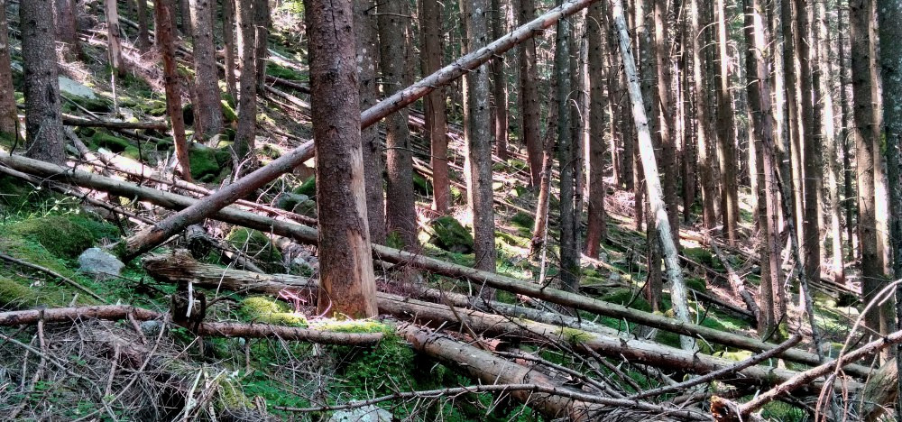
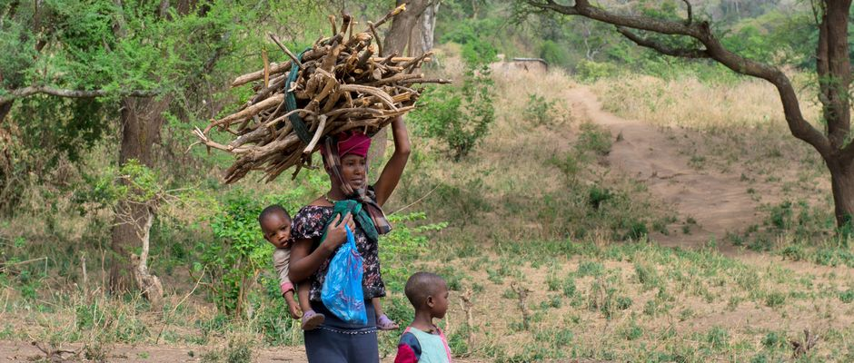

Bei unserer heutigen Wanderung durch den Wald in unmittelbarer Nähe eines kleinen südtiroler Bergdorfes, haben wir beobachtet, dass abseits des Weges der Wald voll von umgefallenen Bäumen ist. Einige liegen offensichtlich schon seit vielen Jahren dort, andere sind erst vor kurzem umgestürzt. Alle warten jedoch nur darauf zu vermodern. Tonnen von wertvollem Brennholz, Megawattstunden von erneuerbarer Energie liegen am Boden. Sie warten auf die langsame Umwandlung in Kohlenstoffdioxid ohne genutzt zu werden.

Vor wenigen Jahrzehnten war die Situation eine ganz andere. Unsere Großeltern nutzten alle verfügbare Zeit, um im Wald Brennholz zu sammeln. Sie hackten und bündelten die herumliegenden Äste und Reiser, trugen sie zum Weg und brachten sie mit dem Schubkarren oder dem Schlitten nach Hause. Damals redete niemand von Energiekrise, erneuerbarer Energie oder nachhaltiger Entwicklung, aber die Leute pflegten einen nachhaltigen Lebensstil.

Heute sammelt praktisch niemand mehr das Schadholz im Wald. Auch in ländlichen Gegenden kaufen die meisten Menschen das benötigte Brennmaterial. In der Tat ist es so, dass eine Person in schwierigem Gelände und mit einfachen Mitteln in einem anstrengenden Arbeitstag Brennholz im Wert von nur etwa 40 Euro sammelt. Bei uns, so wie in den anderen Industrieländern ist das Einkommen für einen Arbeitstag normalerweise viel größer. Die meisten Menschen verdienen also genug, um sich die benötigten Heizmaterialien zu kaufen. Viele verdienen sogar so viel, dass sie sich Flugtickets leisten können um in fernen Ländern Urlaub zu machen. Das haben unsere Großeltern niemals getan, obwohl damals weder die Energiekrise noch der Treibhauseffekt ein Thema waren.

