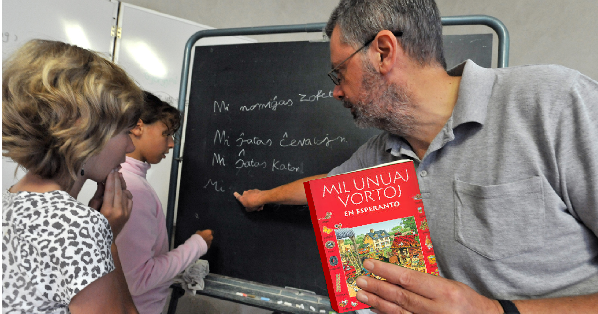

Bei uns in Südtirol ist es trotz jahrzehntelanger Bemühungen von Generationen von Sprachlehrern bisher nicht gelungen, die Mehrheit der Bürger zu echter Zweisprachigkeit zu führen. Nach wie vor können sich viele Menschen im Lande nicht einwandfrei in den Landessprachen Deutsch und Italienisch verständigen. Die von den meisten Eltern gewünschte frühe Einführung des Englischunterrichts an den Grundschulen hat das Problem der mangelhaften Kennnis der beiden Landessprachen eher noch verstärkt. Die derzeit laufenden und geplanten Versuche zur Verbesserung der Situation (mehrsprachige Schule, Fachunterricht in der Zweitsprache, Schüleraustausch ...) sind begrüßenswert und in Einzelfällen möglicherweise zielführend. 

Einen anderen und für Südtirol sicher interessanten Ansatz zeigt das sogenannte [Paderborner Modell](https://it.wikipedia.org/wiki/Metodo_Paderborn) für den Sprachorientierungsunterricht auf.  Ziel des Sprachorientierungsunterrichts ist es, die Schüler während ihrer Grundschulzeit (am besten im 3. und 4. Schuljahr) auf den anschließenden Fremdsprachunterricht so vorzubereiten, dass sie dort dann eine oder mehrere Fremdsprachen mit größerer Leichtigkeit erlernen.

In der zweiten Hälfte der 1970er Jahre wurde unter der Leitung von [Prof. Dr. Helmar Frank](https://de.wikipedia.org/wiki/Helmar_Frank) an einigen Grundschulen im Raum Paderborn das Modell erprobt und die Plansprache Esperanto dazu genutzt, die Schüler an die Reflexion über Sprache heranzuführen.
Dabei konnte bewiesen werden, dass durch das Erlernen der Plansprache Esperanto der eigentliche Lernstoff (in diesem Fall die Fremdsprache Englisch) leichter zu erlernen ist, und dass die für die Orientierung investierte Zeit nachher aufgeholt wird. 

Die Ergebnisse des Paderborner Experiments wurden durch nachfolgende Studien in Italien, Österreich, Slovenien und Kroatien bestätigt.

Einen ähnlichen Weg beschreitet auch das Projekt [Springboard to languages](http://www.springboard2languages.org/) das derzeit an Grundschulen in Großbritannien und in [Israel]( http://vimeo.com/51605995) erprobt wird. 

Selbstverständlich müssten diese Unterrichtsmodelle an die Südtiroler Gegebenheiten angepasst werden, was aber ohne größeren Aufwand möglich ist. 

Als zusätzlicher positiver Nebeneffekt könnte dann das Erlernen von Esperanto zum gemeinsamen identitätsstiftenden Merkmal aller Schüler im Lande werden und dazu beitragen, dass die nach wie vor getrennten Sprachgruppen einen Schritt aufeinander zugehen. 
