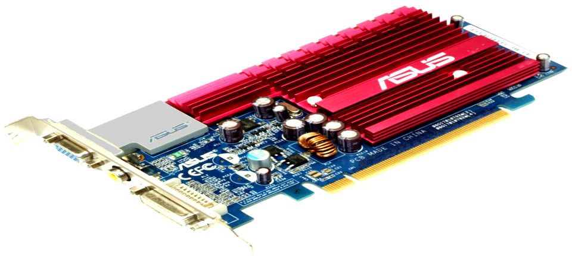

Vor einigen Wochen hat unser zehn Jahre alter Computer den Geist aufgegeben. Nach dem Einschalten hörte man nur ein paarmal piepen und der Bildschirm blieb schwarz.

Aufgrund der Anzahl der Pieps habe ich mit Hilfe des Internets herausgefunden, dass höchstwahrscheinlich ein Defekt der Grafikkarte die Ursache für das Nicht-Funktionieren des Rechners war.

Ohne wirkliche Hoffnung habe ich dann im Netz nach einer eventuellen Reparaturmöglichkeit gesucht und dabei herausgefunden, dass es häufig ausreicht die Grafikkarte im Backrohr zu erhitzen um den Fehler zu beheben. Aus verschiedenen Videos in youtube ging hervor, dass diese Methode in mehr als der Hälfte der Fälle erfolgreich war, dass es dabei aber auch zum Platzen der Kondensatoren kommen kann.

Ich beschloss das Risiko einzugehen und die Grafikkarte (ohne Kühlkörper und Plastikteile) bei 120°C zu backen. Nach 20 Minuten im Backrohr und folgender Abkühlung habe ich die Karte wieder eingebaut und ..... der Computer hat wieder funktioniert. 

Vor ein paar Tagen sind jedoch während des Startens auf dem Bildschirm seltsame Streifen und Quadrate aufgetaucht. Häufig ist er auch überhaupt nicht gestartet und man musste es mehrmals versuchen. Einige der installierten Betriebssysteme sind überhaupt nicht mehr gestartet.

Nachdem ich gelesen hatte, dass es manchmal nicht ausreicht die Grafikkarte auf 120°C zu erhitzen um sie wieder voll funktionstüchtig zu machen, beschloss ich sie nun auf 160°C zu backen. Diesmal schlug mir beim Öffnen des Backrohrs nach 20 Minuten ein ziemlich unangenehmer Geruch entgegen, aber die Karte war noch ganz. Nach dem Abkühlen habe ich sie wieder eingebaut und ..... bis jetzt funktioniert der Computer wieder.

PS: Nach zwei Monaten hat die Grafikkarte wieder den Geist aufgegeben und ich habe sie durch eine neue ersetzt :-(
