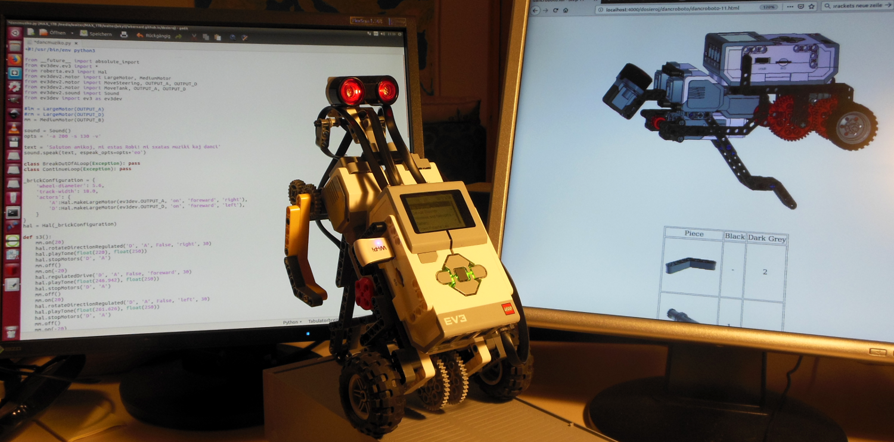

Zur Zeit halte ich einen Kurs für einfache Robotik an meiner früheren Schule und für den Sommer sind solche Kurse auch an der Volkshochschule "Urania" unserer Stadt geplant.  
Bisher haben an meinen Robotik-Kursen immer nur Buben teilgenommen. Deshalb haben wir uns entschieden einen Sommerkurs nur für Mädchen anzubieten. Um den Kurs für Mädchen attraktiver zu machen, habe ich mir gedacht, dass es nützlich sein könnte den Bau eines tanzenden Roboters anzubieten. Zur Vorbereitung habe ich beschlossen zunächst selber einen solchen Roboter zu bauen und zu programmieren. 

Das Ergebnis sieht man auf dem Bild und auf dem [Video](https://www.youtube.com/watch?v=41oDuiZjZpg).

Die [Bauanleitung](../../dosieroj/dancroboto/dancroboto-index.html) und der [Quellcode](../../dosieroj/dancmuziko.py) können herunter geladen werden.

