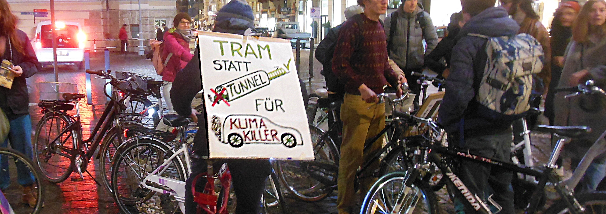

Nächstes Jahr finden in Südtirol, und folglich auch in meinem Wohnort Meran, Gemeindewahlen statt. Obwohl die Klimakrise jeden Tag deutlicher zutage tritt, und obwohl inzwischen klar ist, dass bei uns weiteres Wachstum nicht zu mehr Lebensqualität führt (siehe dazu auch meinen [Beitrag zum Bruttosozialprodukt](https://walter.bernard.im/benessere-non-proporzionale/)), fehlt bisher eine Partei die daraus die nötigen Konsequenzen zieht und diese den Wähler*innen auch zumutet. 

Besonders schwerwiegend ist dies im Bereich Verkehr. Hier muss man leider feststellen, dass zur Zeit alle politischen Parteien die Realisierung der Nord-West Umfahrung im Tunnel samt dazugehöriger Tiefgarage gutheißen. Insgesamt würde dieser Bau über 200 Millionen Euro kosten und sicher nicht zu einer Verringerung der Autofahrten und damit des CO2-Ausstoßes beitragen.

Wenn man will, dass sich die Verkehrsgewohnheiten ändern und dass sich die Bürger vermehrt auf umweltverträgliche Weise fortbewegen, dann darf man nicht in neue Straßen investieren. Die verfügbaren Mittel müssen vorwiegend für den öffentlichen Verkehr eingesetzt werden. Das habe ich bereits im Jahr 2004 vorgeschlagen und dafür auch entsprechende [realisierbare und bezahlbare Projekte](https://walter.bernard.im/tunnel-klein-aber-sofort/) vorgestellt. Bis 2015 hat die Grüne Partei meine Vorschläge unterstützt. Derzeit ist jedoch offensichtlich auch diese Partei und insbesondere der von ihr gewählte Bürgermeister der Meinung, dass man den Gefahren der Klimakrise auch durch den Bau einer Tiefgarage begegnen kann. Zumal das sicher nicht der Fall ist, bin ich der Meinung, dass es in Meran eine neue Partei braucht, welche die Ideen für eine nachhaltige Entwicklung in allen Bereichen konsequent vorantreibt. Dies auch, um den Jugendlichen welche dies in letzter Zeit verstärkt fordern, eine politische Alternative zu bieten.

Als kleinen Beitrag für die Entstehung dieser Partei habe ich ein paar [Symbole](../../bildoj/3simboloj.png) entworfen. Dabei habe ich für den Parteinamen die internationale Sprache Esperanto verwendet, so dass keine Übersetzung erforderlich ist und man sich gleichermaßen an alle Bürger der Stadt wendet.
