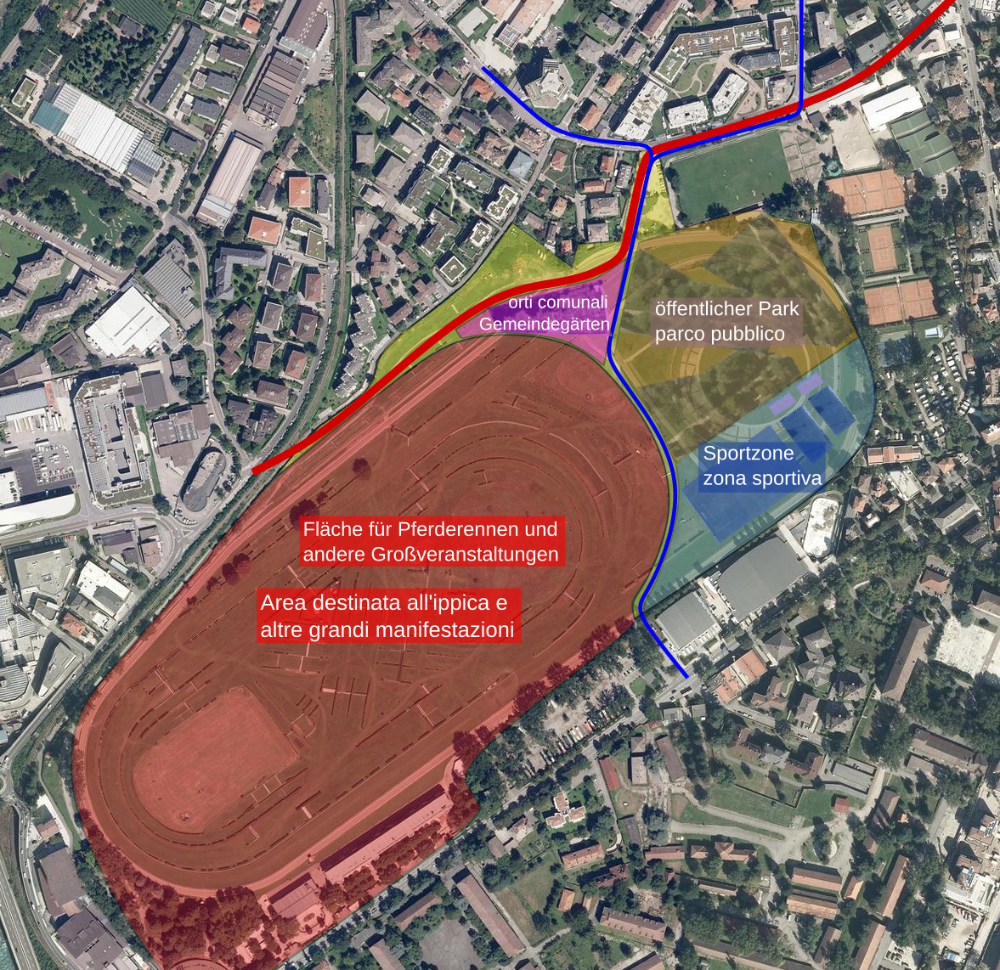

Die Fläche, die der Pferderennplatz in Meran derzeit einnimmt, ist gemessen am Nutzen viel zu groß. Ein wesentlicher Teil des Areals wird praktisch nicht genutzt und dümpelt vor sich hin. Dabei besteht in der Stadt ein erheblicher Bedarf an Freiräumen und Verkehrsflächen, welche auf dem kaum genutzten Teil des Rennplatzes leicht realisiert werden könnten.

Im derzeitigen Ausmaß stellt der Pferderennplatz mit seinen hohen Betonmauern auch eine erhebliche Behinderung für die Mobilität in städtischen Raum dar. Für das seltene Vergnügen weniger müssen viele täglich Unannehmlichkeiten und Umwege in Kauf nehmen.

Es ist deshalb höchst an der Zeit, dass zumindest ein Teil des Rennplatzareals von allen Bürger*innen der Stadt genutzt werden kann.

# Der Vorschlag

Der auf dem Titelfoto gelb markierte Bereich (im wesentlichen der ehemalige Polo-Platz) wird vom Rennplatz abgetrennt und von der Gemeinde für Sport- und Freizeitflächen sowie Verkehrsinfrastrukturen genutzt. Die verbleibende Fläche samt Tribünen wird zu den bestmöglichen Bedingungen an das Land abgetreten, welches darauf eine Infrastruktur im Landesinteresse (auch für den Pferderennsport) betreiben kann.

### Die Verkehrsinfrastruktur

Die Einbeziehung des ehemaligen Polo-Platzes in den allgemein nutzbaren städtischen Raum ermöglicht eine deutliche Verbesserung der Mobilität, sowohl was den motorisierten als auch was den Fuß- und Radverkehr betrifft.

Die in der Karte eingezeichnete rote Linie kennzeichnet eine zweispurige Straße, welche durch eine Eisenbahnunterführung im Bereich der Kreuzung Zuegg - Wolkensteinstraße eine direkte Verbindung der Piavestraße mit der Gewerbezone und der Mebo-Ausfahrt ermöglicht. Dies würde nicht nur die Wolkensteinstraße von jeglichem Durchgangsverkehr befreien, sondern auch den Verkehr in der Marlinger und Manzonistraße sowie im meistbefahrenen Abschnitt der Petrarcastraße reduzieren.

Die blaue Linie kennzeichnet die Fuß- und Radverbindung durch den ehemaligen Poloplatz und die beiden Anschlussverbindungen zur Grundschule in der Totistraße einerseits und zur Fahrradachse Leopardistraße andererseits. Durch Abriss der Mauer des Rennplatzes stünde in der Totistraße ausreichend Platz für einen sicheren Radweg zur Verfügung. Mit dieser schnellen und sicheren Radverbindung zwischen dem Stadtzentrum und der Gampenstraße (Meranarena) könnte ein wichtiger Beitrag für die Reduzierung des innerstädtischen Autoverkehrs geleistet werden.

### Die Sport- und Freizeitflächen

Auf dem Areal des Poloplatzes könnte der bestehende Bedarf an Sport- und Freizeitflächen leicht gedeckt werden.

Als Diskussionsgrundlage und zur besseren Veranschaulichung sind auf der Karte drei Bereiche markiert.

Blau markiert ist eine Sportzone mit einem Fußballplatz, zwei Bolzplätzen und zwei Volleyballfeldern. Auf der verbleibenden Fläche ist noch Platz für andere Sportarten z.B. Cricket.

Der braun markierte Bereich könnte für einen offenen Stadtpark genutzt werden. Auf der Karte kann man erkennen, dass er mehr als dreimal so groß wäre, wie der heutige Bahnhofspark. Entsprechend vielfältig wären die Nutzungsmöglichkeiten.

Lila markiert ist ein Bereich, dessen Fläche etwas größer ist, als die der Gemüsegärten am Friedhof, welche die Gemeinde derzeit zur Verfügung stellt. In diesem Bereich könnten die vielfach begehrten neuen Gärten entstehen.

Das  Areal nördlich der Straße könnte nach dem Abriss der Mauer zum Teil als Kinderspielplatz für die untere Wolkensteinstraße und zum Teil für die Errichtung von gemeindeeigenen Mietwohnungen verwendet werden.

