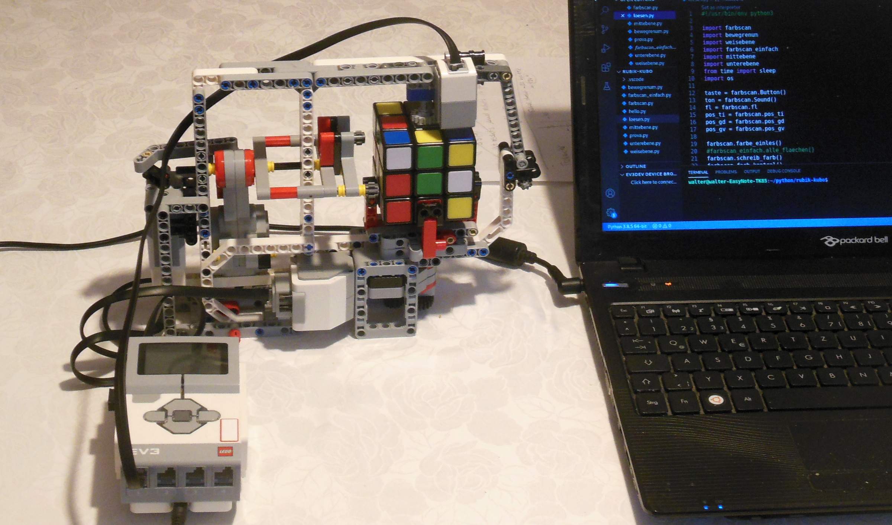

In der Vergangenheit hatte ich bereits mehrmals die Gelegenheit, einen von diesen sogenannten Zauberwürfeln auszuleihen. Ich habe dann ein wenig daran herumgedreht, aber nie ernsthaft versucht den Würfel zu lösen. Die Aufgabe erschien mir stets zu schwierig.

Am Ende des Roboterkurses, den ich letztes Jahr gehalten habe, habe ich aber den besonders interessierten Teilnehmern versprochen, dass wir beim Kurs im nächsten Jahr versuchen würden, einen mit dem Lego EV3-Baustein gesteuerten Roboter zu bauen und zu programmieren, welcher imstande ist den Zauberwürfel zu lösen. Die Teilnehmer haben den Vorschlag begeistert aufgenommen und versprochen am diesjahrigen Kurs teilzunehmen. Aber dann kam Corona, die Pandemie hat unser Leben verändert und derzeit können keine Kurse stattfinden. 
Wir waren und sind gezwungen viel zu Hause zu bleiben und deshalb habe ich beschlossen selbst den Bau und die Programmierung so eines Roboters zu versuchen. Der Bau war einfach, zumal ich dafür die Bauanleitung der ["Roberta-Initiative"](https://www.roberta-home.de/fileadmin/user_upload/Materialien/Bauanleitungen/Bauanleitung_CubeSolver_20-02-18.pdf)  verwenden konnte. Ich habe mir auch das entsprechende Programm der Initiative heruntergeladen, welches in der Programmiersprache Java geschrieben ist. Aber mit diesem Programm ist es mir nicht gelungen den Roboter zum Funktionieren zu bringen. Er ist stets bereits beim Einlesen der Farben des Würfels gescheitert. Da ich nicht in Java programmieren kann, habe ich nicht ernsthaft versucht am Programm etwas zu ändern sondern ich habe beschlossen ein neues Programm in Python zu schreiben, zumal in dieser Programmiersprache über VS-code die Kommunikation mit dem Betriebssystem EV3dev relativ einfach ist. Dennoch war das Ganze für mich eine Mammutaufgabe da ich kaum mehr als die Grundprinzipien von Python beherrsche und da ein aus Lego-Technik Teilen gebauter Roboter nicht sehr präzise arbeitet. Wie man im [Video](https://www.youtube.com/results?search_query=roberta-roboter+l%C3%B6st+zauberw%C3%BCrfel)  sehen kann, ist es mir letztendlich doch gelungen den Roboter dazu zu bringen seine Aufgabe zu erledigen. Das zugrunde liegende Programm orientiert sich an der Anfängerlösung in sieben Schritten. Zunächst wird oben ein weißes Kreuz gebildet und dann wird die obere weiße Fläche vervollständigt. Im dritten Schritt werden die Teile der mittleren Ebene an die richtige Stelle gebracht. Anschließend wird auf der unteren Ebene ein gelbes Kreuz gebildet und die Ebene wird dann mit den gelben Ecken vervollständigt. Im sechsten und siebten Schritt werden zunächst die gelben Kanten und dann die gelben Ecken an die richtige Stelle gebracht.
 
Der Roboter löst den Würfel leider nicht wirklich zuverlässig, besonders beim Einlesen der Farben treten häufig Fehler auf und auch während des Lösungsvorgangs stürzt das Programm manchmal ab. Wenn Sie selber das Programm ausprobieren oder gar verbessern wollen, dann können sie es [hier](https://drive.google.com/drive/folders/1QS3gdjs4p_A8zH5m4D9c7zEqrdMEpN41?usp=sharing) herunterladen.

