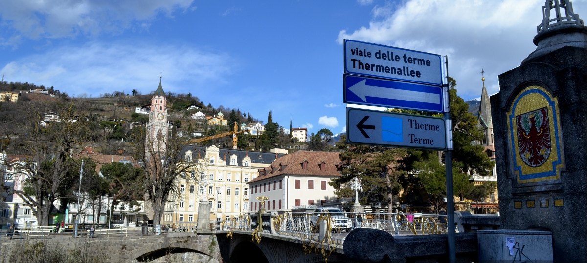

Ekde 2006 la urbeto [Herzberg](http://esperanto-urbo.de/page.php?pid=77507155) en Germanio uzas oficialan kromnomon „la Esperanto-urbo“. Tiam estis fondita "Interkultura Centro", Esperanto estas instruata en kelkaj lernejoj kaj uzata dum la ĝemelurbaj kontaktoj kun [Góra](http://eo.wikipedia.org/wiki/G%C3%B3ra) en Pollando. La iniciato estis varme aplaŭdita kaj konatigis la urbeton tra la tuta mondo. Sed laŭ mi ĝi ne estas vere taŭga por antaŭenpuŝi Esperanton. Fakte Herzberg estas plejparte unulingva urbo kaj pro tio pontlingvo ne estas vere bezonata.

Tute alia estas la situacio en [Merano](http://eo.wikipedia.org/wiki/Merano). De la 40.000 loĝantoj proksimume 43% apartenas al la germana etna grupo kaj 43% al la itala. La aliaj estas aŭ ladinoj aŭ eksterlandanoj kiuj havas tute aliajn gepatrajn lingvojn. Ne ekzistas komuna lingvo perfekte komprenata de ĉiuj, sed ĉiuj konas almenaŭ parte kaj la germanan kaj la italan. Sekvas, ke la plejmulto de la loĝantoj de Merano konas almenaŭ 80% de la radikoj de Esperanto kaj la bazo por rapida vasta lernado de la internacia lingvo estus ideala. Cetere la enkonduko de Esperanto kiel tria lingvo en bazlernejo laŭ la metodo ["saltotabulo al lingvoj"](http://egalite.hu/salto/saltohu.htm) povus esti ideala vojo al vera plurlingveco kaj al pli bona interkompreniĝo de la entnaj grupoj.

Por realigi tiun iniciaton necesas fondi "Interkulturan Centron", kiu akompanas ĝin. Tiu centro kiel parto de la [Libera Universitato de Bolzano](https://eo.wikipedia.org/wiki/Libera_Universitato_de_Bozen-Bolzano) povus iĝi internacia referenccentro por aplikata interlingvistiko kaj kunlabori kun aliaj centroj pri interlingvistiko kiel [Poznano](http://www.staff.amu.edu.pl/~interl/interlingvistiko/index.html) kaj [Amsterdamo](http://uva.academia.edu/FedericoGobbo/Informigaj-tekstoj).
