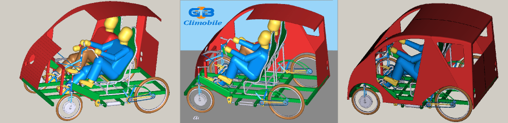

“Climobile” - “klimveturilo” estas projekto, kiun mi realigis en la teknika lernejo de Merano kune kun la kolego Peter Oberhofer kaj grupo da lernantoj. Uzante kiel krudmaterialo precipe pecojn de ne plu uzeblaj bicikloj, ni sukcesis konstrui interesan veturilon por du personoj. Dum tri jaroj (2008-2011) la lernantoj venis al la lernejo por unu plia posttagmezo semajne kaj kun entuziasmo diligente laboris al la projekto.

La [prezentaĵo](../../dosieroj/Climobile-1.pdf) montras la laborojn dum la unua lernojaro (2008-2009), en la 12-minuta [filmo](https://www.youtube.com/watch?v=9YMkdvn7PWo) videblas laboroj dum la tuta labortempo kaj en la [filmeto](https://www.youtube.com/watch?v=9UoWeJL2lDM) vi povas vidi la funkciantan veturilon.
