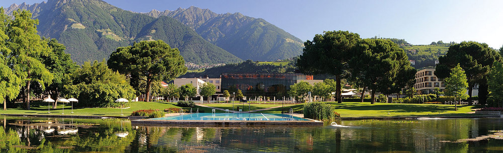

En printempo 2003, antaŭ la komenco de la konstruaĵo de la novaj termoj en Merano, mi prezentis en publika parolado kelkajn proponojn, kiuj celis malpliigi la konsumon de ne-renovigebla energio en la nova konstruaĵo. 

Por atingi la celon mi proponis la sekvajn rimedojn. 

1. sunkolektiloj (600 m²) por varmigi akvon sur la tegmento de la kuracejo 

2. sunkolektiloj (200 m²) je la suda muro de la kuracejo por varmigi la areon kiu necesas por aerumado de la naĝohalo 

3. aerumitaj fotovoltaaj ĉeloj (800 m²) sur la vitra tegmento de la naĝohalo por la aerumado de la halo kaj por gajni elektran energion

4. sunkolektiloj (800 m²) sur la tegmento de la hotelo por varmigi akvon kaj por utiligi la varmon por sunenergia malvarmigo 

La tuta kosto de la suninstalaĵo estis egala al 2 milionoj da eŭroj kaj per ĝi estus ebligite kovri per sunenergio 30% de la bezonata energio de la termoj. 

En la jaro 2014 la energikostoj de la termoj egalis al 1,2 milionoj da eŭroj. Sekvas, ke la investokostoj por la suninstalaĵo estus amortizitaj post 5 ĝis 6 jaroj. Kaj nun la termoj povus ŝpari preskaŭ 400.000 eŭrojn jare. 

Bedaŭrinde nek niaj regantoj nek la planantaj teknikistoj serioze konsideris miajn proponojn. 

