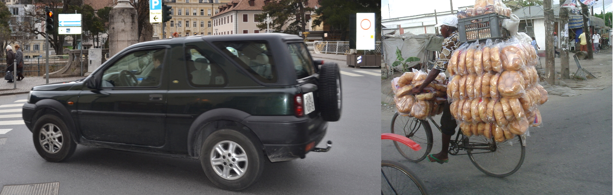

Inter la laboroj faritaj de niaj lernantoj dum la projekto ["Climobile"](/klimveturilo/) troviĝas ankaŭ prezentaĵo, kie estas klarigata kiom grandas la [efikeco](https://eo.wikipedia.org/wiki/Efikeco) de aŭtoj. En multaj [fontoj](http://www.greengear.de/notwendigkeit-verbrennungsmotor/) legeblas, ke la efikeco de autoj kun benzinmotoro egalas proksimume al 16%. 

Sed tiu voloro konsideras nur la perdojn de energio en la motoro kaj en la transmisiilo de la aŭto. Ne estas konsiderata la fakto, ke plejparto de la restanta energio ne estas utiligata por transporti utilan ŝarĝon (personojn aŭ varojn) sed por transporti la aŭton mem. 

Kiam ekzemple en aŭto kun maso egala 1500 kg veturas nur unu persono, kies maso egalas al 80 kg, tiam la utila ŝarĝo transportata estas nur 5% de la tuto (80kg/1580kg=0,05=5%). Sekvas, ke nur 5% de la 16% da energio disponeblaj por la movo de la veturilo, movas utilan ŝarĝon kaj la tuta efikeco de la veturilo egalas nur al 0,05x16%=0,8%.  

###Nur proksimume 1% de la energio enhavita en la benzino estas utiligata por movi utilan ŝarĝon.###

La valoro evidente estas des pli malgranda, ju pli granda estas la maso de la aŭto. 

Malgraŭ tio en la lastaj 30 jaroj la meza maso de la aŭtoj kreskis proksimume je 60% kaj en [kelkaj landoj](http://www.bfe.admin.ch/energie/00588/00589/00644/index.html?lang=de&msg-id=26779) atingis jam la valoron de 1500 kg.

Tia evoluo tutcerte ne estas daŭripova.

**La tuta prezentaĵo en la germana kaj itala elŝuteblas [ĉi tie](../../dosieroj/climobile_final.pdf).**

