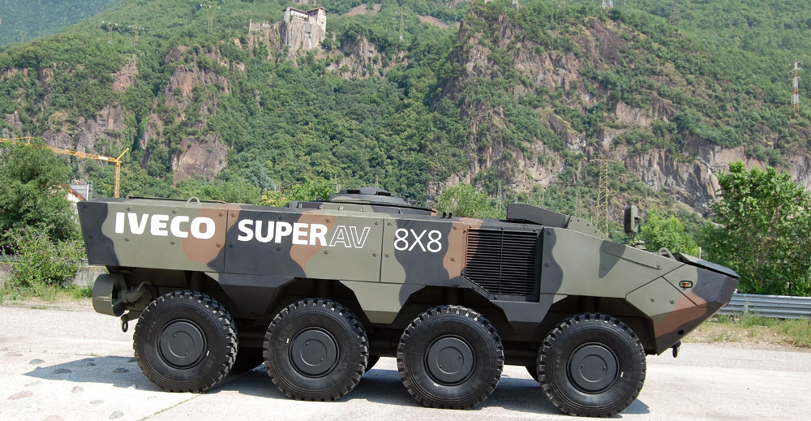
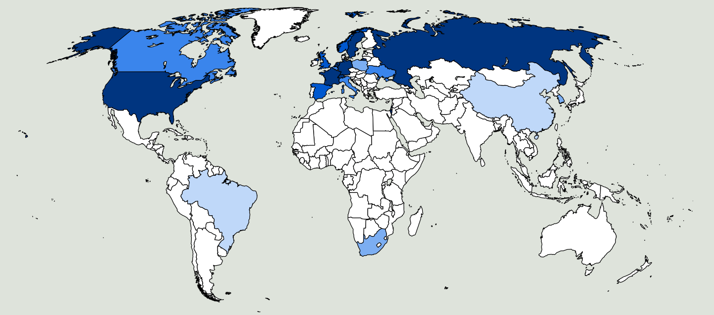
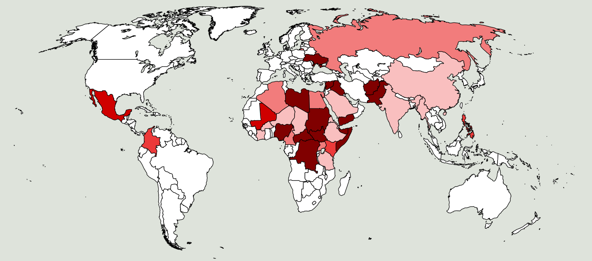

Je la fino de la 70aj jaroj mi estis juna inĝeniero kaj laboris en fabrikejo por kablovojoj en Vipiteno, urbo kiu sufiĉe malproksimas de mia hejmurbo Merano. Mi deziris laboron en loko pli proksima kaj kiam mi vidis en ĵurnalo, ke la firmao IVECO de Bolzano serĉis inĝenieron, mi tuj prezentis mian aspiron al la posteno.  Mi estis invitita fari eksamenon pri miaj teknikaj konoj, mi havis interparolon kun la ĉefinĝeniero kaj ili montris al mi la produktejon. Tiam mi rimarkis, ke la ĉefa produkto de la fabrikejo de Bolzano ne estis kamionoj, kiel mi antaŭe pensis, sed kirasitaj veturiloj por la armeoj. Tio ne plaĉis al mi. Post proksimume unu semajno la ĉefinĝeniero kontaktigis min telefone dirante, ke ili estus pretaj dungi min kiel projektinĝeniero. Sed mi diris al li, ke mi ne plu aspiris al la posteno, ĉar mi ne volis partopreni al la produktado de armiloj. Fakte mi jam tiam estis konvinkita, ke: 

<b>Kiu produktas la armilojn, kunkulpas kiam ili mortigas</b>

 
<small>La dudek plej gravaj armileksportantaj landoj</small>

En la supra bildo la [dudek plej gravaj armileksportantaj landoj](http://diepresse.com/home/wirtschaft/international/717003/Die-20-grossten-Waffenexporteure-der-Welt) estas koloritaj per blua koloro. Ju pli granda estas la pokapa kvanto da eksportitaj armiloj, des pli malhela estas la koloro. 

La suba bildo montras la landojn en kiuj en la jaro 2014 okazis militoj aŭ gravaj armitaj atakoj. Ili estas koloritaj kun ruĝa koloro, des pli malhela, ju pli alta estis la nombro da viktimoj. 

<small>Landoj en kiuj en 2014 okazis militoj aŭ gravaj armitaj konfliktoj</small>

En la sekva tabelo en la maldekstra parto estas listigitaj la landoj, kiuj eksportis en 2011 pli da [armiloj rilate al nombro da loĝantoj](https://professorsblogg.files.wordpress.com/2014/05/swe-export-per-capita.png) kaj ties malneta enlanda produkto (MEP). En la dekstra parto estas listigitaj la landoj, kie okazis la plej [gravaj militoj en 2014](http://hiik.de/en/downloads/) kaj ties malneta enlanda produkto.  

|lando eksportanta armilojn|eksportitaj armiloj US$/loĝ|MEP (nom) US$/loĝ|lando kun milito (2014)|MEP (nom) US$/loĝ|
|-|-|-|-|-|
|Svedio|73|56900|DR Kongo|150|
|Israelo|72|38000|Somalia|240|
|Rusio|55|14800|Centr-Afrika Respubliko|400|
|Francio|39|44000|Afganistano|500|
|Svislando|39|81200|Sud-Sudano|1000|
|Nederlando|32|50400|Jemeno|1000|
|Usono|32|48400|Nigerio|1600|
|Norvegio|22|99200|Pakistano|2600|
|Hispanio|20|32400|Sirio|2600|
|Britio|17|39200|Irako|3500|
|Italio|17|36300|Ukrainio|3900|
|Germanio|15|45000|Libio|11000|

La bildoj kaj la tabelo montras, ke la armileksportantaj landoj kaj la landoj en kiuj okazas la militoj estas tute aliaj. Dum la nordamerikaj kaj eŭropaj landoj gajnas multe da mono kaj pliigas ilian malnetan enlandan produkton per armileksportado, la plej malriĉaj landoj de la mondo suferas pro milito kaj terorismo.

Evidentas por mi, ke la riĉezo de la armilproduktantaj landoj baziĝas ankaŭ sur la doloro de la homoj en la plej malriĉaj landoj, kie la armiloj estas uzataj.

Por la riĉaj landoj tre bona maniero por kontribui al monda paco kaj justeco estus redukti la produktadon de armiloj kaj tute malpermesi ilian eksportadon. La pro tio sekvanta malgranda malpliiĝo de la malneta enlanda produkto [ne malpliigus la bonfarton](http://walter.bernard.im/bonfarto-ne-estas-proporcia/) de la loĝantoj en la riĉaj landoj. Sed la vivkvalito en la malriĉaj landoj tutcerte kreskus kaj ne tiel multaj homoj estus devigitaj forfuĝi de siaj landoj. 

