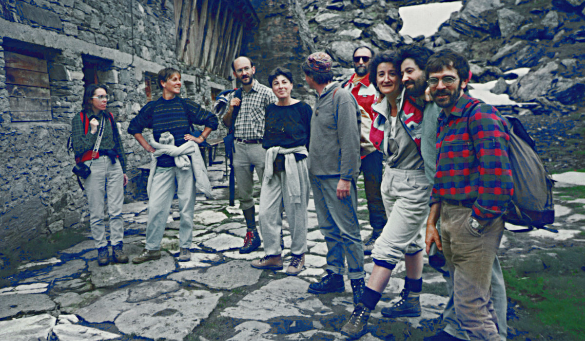
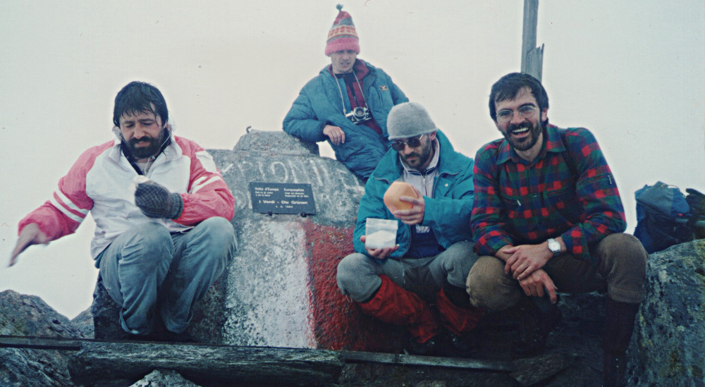

Antaŭ dudek jaroj mortis [Alex Langer](https://eo.wikipedia.org/wiki/Alexander_Langer) sudtirola pacbatalanto, mediprotektanto kaj deputito de la landa kaj de la eŭropa parlamento. 

Komence de junio 1989 Alex iniciatis agadon por antauenpuŝi la ideon de paco inter la popoloj kaj de frateco inter la homoj kaj la naturo. 
Li invitis grupon da amikoj kaj naturprotektantoj  al suprenirado de la plej norda montopinto de Italio kun du celoj: alinomado de la pinto kaj diskonigo de la [deklaracio de la eŭropaj verduloj](https://riccardodellosbarba.wordpress.com/2011/02/19/vetta-deuropa/) favore al la protektado de la Alpoj.

Fakte la nomo de la pinto kaŭzis kaj kaŭzas oftajn disputojn inter kelkaj reprezentantoj de la du plej grandaj etnaj grupoj loĝantaj en Sudtirolo. Antaŭ la unua 
mondmilito la provinco apartenis al Austrio-Hungario, la loĝantoj estis plejparte germanlingvaj kaj la nomo de la pinto estis ["Klockerkarkopf"](https://de.wikipedia.org/wiki/Klockerkarkopf). Ek de 1918 la provinco apartenas al Italio kaj en la faŝisma periodo estis enkondukita la nomo ["Vetta d'Italia"](https://it.wikipedia.org/wiki/Vetta_d%27Italia), kiu ĝis hodiaŭ estas la oficiala nomo en la itala. 

Alex proponis doni novan nomon al la pinto. Tiu nomo devis esti internacia kaj taŭga por ĉiuj amantoj de paco kaj de interkompreniĝo. Li proponis la nomon "Pinto de Eŭropo".

Mi partoprenis al la agado kaj volonte memoras ĝin. Ni renkontiĝis unuafoje la 4-an de junio 1989 en Kasern, malgranda vilaĝo piede de la pinto. La vetero estis malbela sed nur iom pluvetis kaj ni komencis la supreniradon. La partoprenantoj estis plejparte el Sudtirolo, sed akompanis nin ankaŭ Karl Bartsch, botanikisto kaj naturprotektanto el Germanio. Li klarigis al ni la gravecon de plantoprotektado en la Alpoj. Dum la suprenirado la vetero malbeliĝis kaj la neĝo sur la pado pli kaj pli altiĝis. Kiam ankaŭ la nebulo iĝis ĉiam pli densa, ni estis devigitaj returniĝi al Kasern. Tie estis oficiale diskonigata la deklaracio favore de la Alpoj kaj ni decidis novan daton por kompletigi la alinomadon de la montopinto.

Du semajnoj poste okazis europaj balotoj. Alex estis elektita kiel deputito al europa parlamento.

Komence de julio ni denove renkontiĝis en Kasern. 

<small>Alex Langer (kun ĉapo) meze de kelkaj de la partoprenantoj kiuj celis atingi la montopinton komence de julio.</small>

Ankau ĉifoje la vetero ne estis bela sed la nuboj estis sufiĉe altaj kaj ni komencis supreniradon. Akompanis nin [Carlo Alberto Pinelli](http://www.carloalbertopinelli.it/professione.htm) konata itala reĝisoro de dokumentaj filmoj kaj mediprotektanto. Kiam ni jam estis sufiĉe proksimaj al la pinto la vetero malbeliĝis kaj kelkaj el la grupo (precipe la pli prudentaj virinoj) proponis returniĝi. Post mallonga konsultiĝo Alex decidis akompani la pli grandan parton de la grupo valen kaj nur grupeto daŭrigis la supreniradon.

Ni atingis la pinton senprobleme kaj sukcesis fiksi ŝildon sur la pintoroko. Sur la ŝildo estas skribite:

###Europaspitze – Friede den Menschen, Bruderschaft mit der Natur – Die Grünen / Vetta d’Europa – Pace tra gli uomini e con la natura – i verdi / 4.6.1989### 

####Pinto de Europo – Paco al la homoj, frateco kun la naturo – La Verduloj / 4-a de junio 1989####

<small>Grupo da partoprenantoj sur la pinto de Eŭropo post fiksado de la ŝildo kun la novaj nomoj  <bold>"Vetta d'Europa - Europaspitze"</bold></small>

