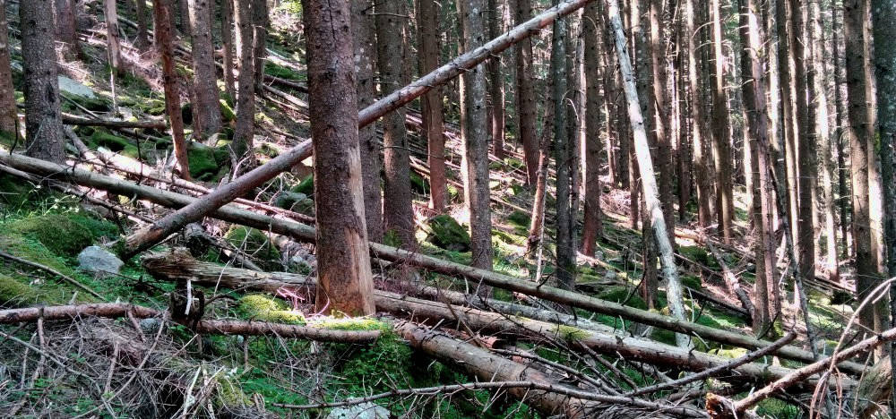
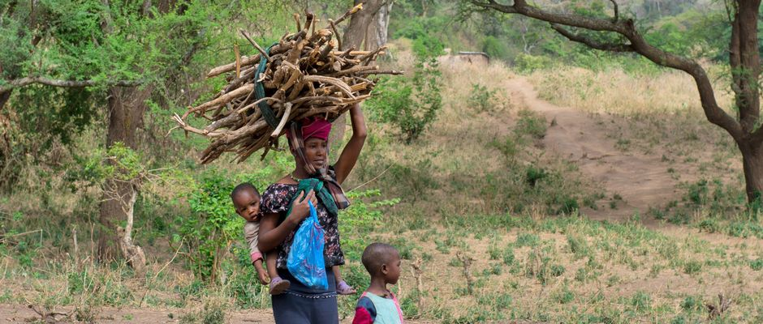

Tiutage ni ferias en monta regiono de Sudtirolo kaj hodiaŭ ni iris tra la arbaro proksime al nia feriejo. Kiam ni iom forlasis la ĉefan padon kaj eniris la arbaron, ni vidis, ke la tuta arbaro estas plenplena de falintaj arboj. Kelkaj estas falintaj jam antaŭ multaj jaroj, aliaj nur antaŭ malmulte da tempo. Sed ĉiuj estas tie nur por atendi putradon. Tunoj da valora brulmaterialo, megavathoroj da renovigebla energio kuŝas tere atendante malrapidan transformiĝon al karbondioksido sen esti utiligata. 

Antaŭ kelkdekaj jaroj la situacio estis tute alia. Niaj geavoj, ĉiam kiam ili havis iom da tempo, iris tra la arbaro por kolekti lignaĵojn. Ili tranĉis kaj kunigis la branĉojn, portis ilin al la pado kaj de tie transportis la materialon hejmen per puŝĉaro aŭ sledo. Kvankam neniu parolis pri energikrizo, renovigebla energio aŭ daŭripova evoluo, la homoj vivis en daŭripova maniero.

Nuntempe preskaŭ neniu kolektas la damaĝlignaĵojn en niaj arbaroj. Ankaŭ en kamparaj regionoj oni plejofte aĉetas la brulmaterialon, kiu neĉesas por varmigi la domojn. Fakte la valoro de la lignaĵo, kiun oni sukcesas kolekti dum tuttaga streĉa laboro egalas al proksimume 40 Eŭrojn. Ĉe ni, kiel en la aliaj industriiĝintaj landoj, la plejmulto de la homoj sukcesas gajni multe pli dum kutima labortago. Por ili la enspezita mono sufiĉas ne nur por la brulmaterialo, sed kelkfoje eĉ por aĉeti flugbiletojn kaj ferii en foraj landoj.  Tion niaj geavoj neniam faris, kvankam tiutempe neniu parolis pri energikrizo aŭ pri globala tervarmiĝo.

