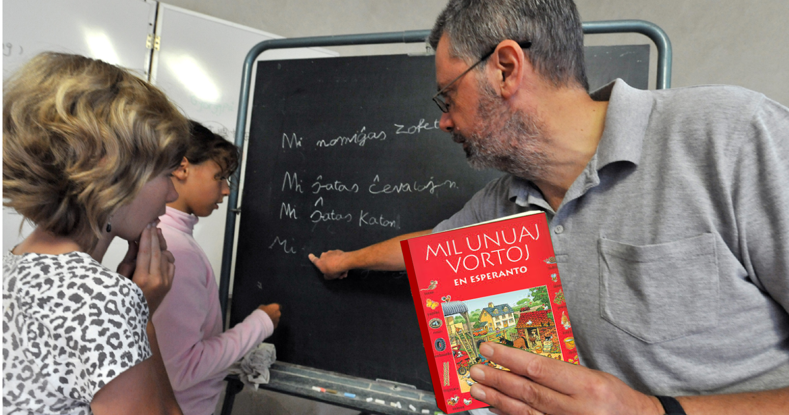

Ĉe ni en Sudtirolo malgraŭ jardekoj da klopodoj, generacioj da lingvoinstruistoj ne sukcesis, konduki la plejmulton de la loĝantaro al vera dulingvismo. Ĝis nun multaj homoj en la lando ne kapablas, korekte komuniki en la du grandaj oficialaj lingvoj, la germana kaj la itala. Post la enkonduko de la instruado de la angla en bazlernejoj, bonvenigita de la plejmulto de la gepatroj, la kono de la dua lingvo ofte eĉ malpliiĝis. Nuntempe oni provas apliki kaj planas kelkajn rimedojn, por plibonigi la situacion (plurlingva lernejo, fakinstruado en la dua lingvo, interŝanĝo de lernantoj inter lernejoj kun malsama instrulingvo ...). Tio estas bonvena kaj en kelkaj individuaj kazoj eble estos sukcesa. 

Alian kaj por Sudtirolo certe interesan aliron al la problemo, montras la [Paderborna modelo de LOI](https://eo.wikipedia.org/wiki/Metodo_Paderborn) (Lingvo-Orientiga Instruado). La celo de lingvo-orientiga instruado estas, pretigi la lernantojn en bazlernejo (plej bone en la tria kaj kvara lernojaro) por la pli posta instruado de fremdaj lingvoj, kiu tiamaniere estas faciligata. 

En la dua duono de la 1970aj jaroj la metodo estis aplikita sub la gvido de  [Prof. Dr. Helmar Frank](https://https://eo.wikipedia.org/wiki/Helmar_Frank) en kelkaj bazlernejoj de la regiono de Paderborn. La planlingvo Esperanto estis uzata kiel ilo por  konduki la lernantojn al meditado pri lingvoj.

La eksperimento montris, ke dank'al la antaŭa lernado de la bazaj elementoj de Esperanto la sekva lernado de la celita fremdlingvo (en Paderborn estis la angla) estis pli facila kaj oni povis facile regajni la tempon bezonatan por la orientiga periodo.

La rezultoj de la Paderborna eksperimento estis konfermitaj ankaŭ de aliaj eksperimentoj efektivigitaj en Italio, Austrio kaj Slovenio.

Similan aliron al la lingvoinstuado proponas ankaŭ la projekto [Springboard to languages](http://www.springboard2languages.org/) kiu estas nuntempe aplikata en kelkaj bazlernejoj en Britio kaj [Israelo]( http://vimeo.com/51605995) . 

Kompreneble se oni volas apliki tiujn metodojn en Sudtirolo, ili devas esti adaptitaj al la loka situacio, sed tio eblas senprobleme. 

Pozitiva kromefiko de la metodo estus, ke la lernado de Esperanto povus iĝi  komuna identigilo de ĉiuj lernantoj de la provinco kaj tiamaniere kontribui al aproksimiĝo de la etnaj grupoj, kiuj daŭre estas tro disigitaj.