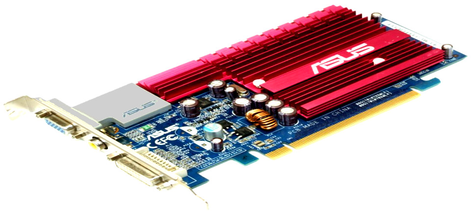

Antaŭ pluraj semajnoj nia dekjaraĝa komputilo ĉesis funkcii. Post la enŝalto oni aŭdis nur plurajn bip-sonojn kaj la ekrano restis nigra.  

Baze de la nombro de la bip-sonoj mi trovis en interreto, ke la kialo de la malfunkciado plejverŝajne estis difekto de la vidkarto. 

Sen vera espero mi decidis serĉi en reto ĉu iu, iam sukcesis ripari vidkarton kaj mi trovis plurajn, kiuj skribis ke ofte sufiĉas baki la karton en forno por refunkciigi ĝin. Tiurulate mi spektis ankaŭ kelkajn filmetojn en jutubo el kiuj rezultas, ke kvankam kelkfoje dum la bakado eksplodas kondensatoro, pli ol duono de la provoj estis sukcesaj.

Mi decidis riski. Mi malmuntis la vidkarton, malmuntis la varmdisipilon kaj la plastajn partojn de ĝi, envolvis ĝin en aluminia folio, varmigis la fornon al temperaturo de 120°C kaj metis la karton en la forno. La sekvaj dudek minutoj estis iom streĉaj sed bonŝance nenio okazis. Mi malfermis la fornon, atendis la malvarmiĝon de la karto kaj remuntis ĝin en la komputilon..... kaj ĝi denove funkciis. 

Sed antaŭ kelkaj tagoj dum la startigo de la komputilo komencis aperi strangaj strioj kaj kvadratoj sur la ekrano. Kelkfoje la komputilo eĉ ne startis kaj necesis restartigi ĝin plurfoje. Kelkaj el la instalitaj operaciumoj tute ne startis. Mi provis reinstali la praŝargan administrilon, sed la situacio ne pliboniĝis. 

Ĉar mi estis leginta, ke kelkfoje 120°C ne sufiĉas por bone refunkciigi la vidkarton, mi supozis, ke la kialo de la nova malfunkiado estus denove la vidkarto. Mi do decidis ripeti la bakadon de la karto je la pli alta temperaturo de 160°C. Ĉifoje malferminte la fornon post dudek minutoj eliris malagrabla odoraĉo sed ŝajne la karto estis sendifekta. Mi remuntis ĝin post la malvarmiĝo kaj ..... ĝis nun la komputilo denove bone kaj regule funkcias.