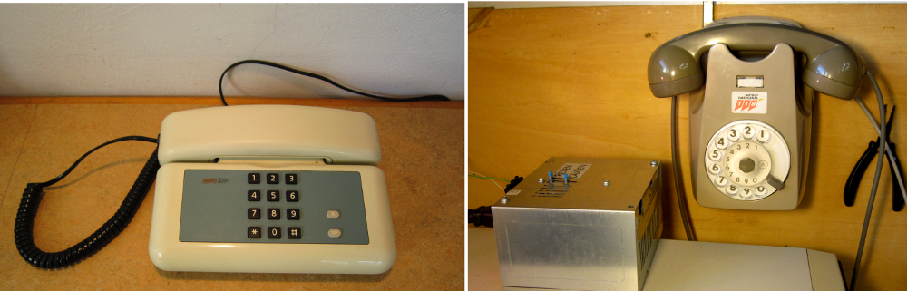
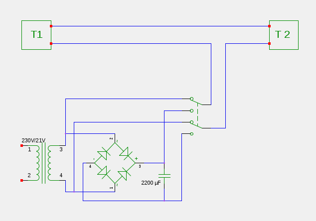

Da un po di tempo avevo in garage due vecchi telefoni. Più volte ho pensato, che potrei utilizzarli come mezzo di communicazione tra il garage e l'appartamento. Tale mezzo di communicazione può sembrare anacronistico nel tempo dei telefoni tascabili. A me l'idea di utilizzare i due telefoni è piaciuta per almeno due motivi. Primo perchè in questo modo evito che diventino un rifiuto speciale e secondo, perchè non possiedo un telefonino. 

Cercando in rete ho scoperto, che la realizzazione del idea non è semplice ma fattibile. Perchè il tutto funzioni, i due telefoni collegati in serie devono essere alimentati da una tensione alternata per far funzionare la suoneria e ad una tensione continua quando si parla. Entrambe le tensioni devono essere uguali a circa 20V.

Fortunatamente tra i rifiuti elettrici nel mio gaage ho trovato tutti i componente per realizzare il circuito seguente.

Il trasformatore fornisce una tensione di 21 V la quale viene trasformata in tensione continua dal ponte a quattro diodi e dal condensatore da 2200µF. Ho trovato questi componenti in un alimentatore smontato da un vecchio computer. Il deviatore che permette di collegare il circuito alla tensione alternata oppure a quella continua viene da una vecchia radio portatile, che ho smontato qualche tempo fa. 

Ho messo il trasformatore e il circuito dentro la scatola del alimentatore smontato, ho portato due fili elettrici dall'appartamento al garage attraverso un camino fuori uso e ho collegato i due telefoni. 

Se si è attenti che per la chiamata il deviatore si trova in posizione "alternata" allora, quando si solleva la cornetta di un telefono, l'altro suona. Per parlare bisogna poi portare il deviatore in posizione "continua" e la communicazione funziona. 