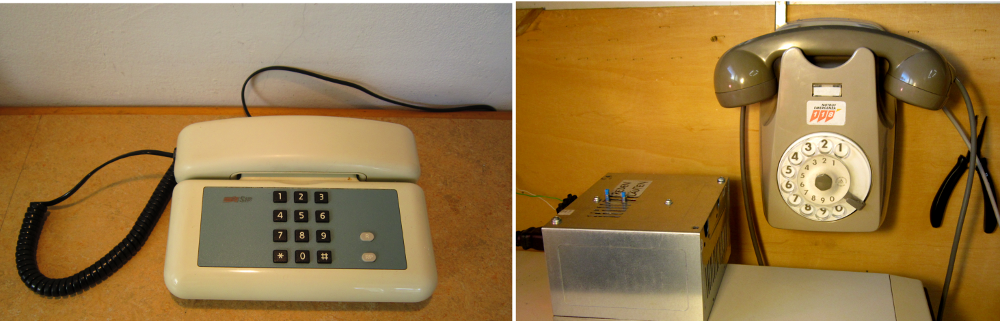
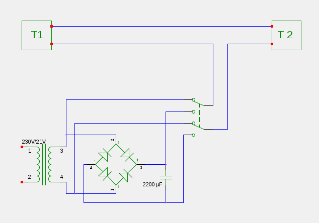

Jam de kelka tempo mi havis du malnovajn telefonojn en mia garaĝo. Plurfoje mi pensis, ke ili povus utili por havi komunikilon inter la garaĝo kaj la apartamento. Tia komunikilo en la tempo de poŝtelefonoj povas ŝajni anakronisma, sed mi decidis ke mi provu konekti la du telefonojn unue, ĉar tiel ili ne iĝas rubaĵo kaj due, ĉar mi ja ne posedas poŝtelefonon.  

Serĉante en interreto, mi malkovris, ke la afero ne estis simpla sed realigebla. Fakte la du telefonoj konektitaj en serio devas esti konektitaj al alterna tensiofonto por funkciigi la sonorilon kaj al kontinua tensio dum parolado. La valoro de ambaŭ tensioj devas esti proksimume 20 V.  

Bonŝance inter la elektra rubaĵo en mia garaĝo mi trovis ĉiujn komponantojn por realigi la sekvan cirkviton.

La transformatoro eldonas alternan tension de 20 V, kiu estas transformata en kontinua tensio helpe de la kvar diodoj kaj de la kondensatoro kun 2200 µF. Ĉilastajn mi trovis sur tensio-adaptilo malmuntita de malnova komputilo. La ŝaltilo kiu permesas konekti la cirkviton aŭ al alterna aŭ al kontinua kurento estas peco de portebla radio, kiun mi estis malmuntinta antaŭ iom da tempo. 

Mi muntis la transformatoron kaj la cikviton ene de la ladskatolo de la demuntita tensio-adaptilo, portis kablon trans la ne plu uzata kamino de la garaĝo al apartamento kaj konektis la du telefonojn. 

Nun eblas komuniki senprobleme inter garaĝo kaj apartamento.