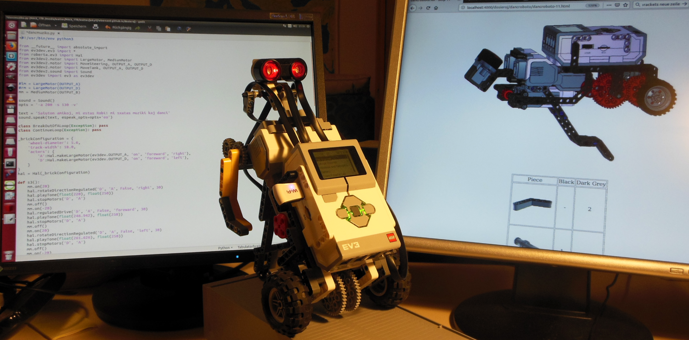

Nuntempe mi instruas iom da simpla robotiko al junuloj en lernejo kaj por la venonta somero mi planas saman kurson ankaŭ en la popola altlernejo "Urania" de nia urbo.  
Ĝis nun la partoprenantoj en miaj robotik-kursoj estis ĉiuj viraj. Tial ni decidis, ke unu de la someraj kursoj estu dediĉita nur al knabinoj. Mi pensis, ke por allogi knabinojn povus esti utila proponi la konstruadon de dancanta roboto. Mi do decidis mem konstrui kaj programi tian roboton.

La rezulto videblas en la supra bildo kaj en la [filmeto](https://www.youtube.com/watch?v=41oDuiZjZpg). 

Estas elŝuteblaj la [instrukcioj por la konstruado](../../dosieroj/dancroboto/dancroboto-index.html)  kaj la [programkodo](../../dosieroj/dancmuziko.py).