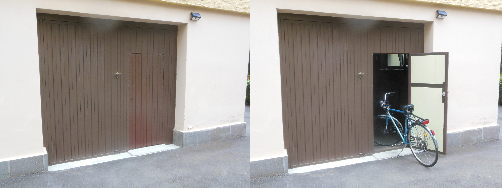

Durante le ultime settimane sono stato molto occupato per realizzare finalmente uno dei miei progetti, che avevo in mente già da alcuni anni.

Ogni giorno, quando andavo nell'orto ho dovuto aprire il portone del garage per cambiare le scarpe prendere gli atrezzi. Il portone è molto vecchio e aprirlo é diventato sempre più faticoso. Ho provato a lubrificare e ho cambiato anche alcuni perni, ma la situazione non è veramente migliorata. Perciò ho pensato, che potesse essere una buona idea fare una piccola porta nel portone. Attraverso questa porta si sarebbe potuto entrare e mettere le biciclette nel garage. E siccome non possediamo un'auto sarebbe stato necessario aprire il portone solo in rare occasioni.

Ho fatto un disegno della costruzione e sono andato da un fabbro per chiedergli un preventivo. Mi ha detto, che non valeva la pena fare questo lavoro, avrebbe costato almeno 700 euro, non avrebbe funzionato bene e un portone nuovo avrebbe costato solo poco di più. Siccome non volevo rottamare il portone vecchio ho lasciato perdere del tutto. 

Alcuni mesi fa mia fratello ha cambiato le finestre del suo appartamento e come è normale ai nostri tempi, le finestre vecchie erano destinate all'immondizia. Abbiamo deciso di conservarne due per un eventuale uso dei vetri. 

Alcune settimane fa, avendo ripetutamente visto le finestre inutilizzate mi venne un idea. Potrei usare il legname delle finestre per costruire i telai della porta nel portone del garage. Durante le ultime settimane ho realizzato questa idea e sono molto contento del risultato. Guardando la foto potete giudicare anche voi.