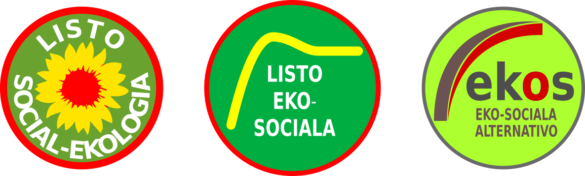

Venontjare okazos la komunumaj balotoj en nia provinco kaj sekve ankaŭ en mia loĝurbo Merano. Bedaŭrinde, kvankam la klimata krizo fariĝas ĉiutage pli evidenta kaj jam estas konate, ke plia kresko ne plialtigos la bonfarton de la homoj en niaj regionoj (vidu mian artikolon pri la [malneta enlanda produkto](https://walter.bernard.im/bonfarto-ne-estas-proporcia/)), mankas partio kiu kuraĝas diri tion al la elektantoj. Eĉ la partio de la Verduloj en Merano nun konformiĝis al la pozicioj de la libera ekonomio. 

Tio estas aparte grava en la kampo de trafiko. Tamen ŝajnas, ke aktuale ĉiuj politikaj partioj (inkluzive de la Verduloj)  konsentas, ke utilas konstrui ĉirkaŭstraton en tunelo por faciligi la aŭtoveturadon en kaj tra la urbo. Kune kun la planita subtera parkejo la kosto de tiu konstruaĵo superos 200 milionojn da Eŭroj kaj certas ke per ĝi la kvanto de la cirkulantaj aŭtoj ne malpliiĝos. 

Por daŭropova evoluo la de la movadokutimoj kaj por redukti la aŭtoveturadon necesas investi monon ne en novaj stratoj se en publikaj transportiloj. Tion mi jam proponis en la jaro 2004 faranta rapide realigeblajn projektojn. Ĝis la jaro 2015 ekzistis politika partio en Merano, kiu subtenis miajn ideojn, la Verduloj. Sed nuntempe evidente ankaŭ tiu partio kaj aparte la de ĝi elektita urbestro, ŝajnas esti blindigita de la ideo de daŭra kreskado. Tial mi opinias, ke necesas nova politika partio kiu subtenas la ideon de daŭropova evoluo en ĉiuj kampoj. Tia partio povas esti ankaŭ valida elekto por la junuloj, kiuj dum la nunaj tagoj protestas surplace postulante konkretaj ago por eviti la klimat-katastrofon.

Por kontribui al naskiĝo de tiu nova partio mi dezegnis kelkajn simbolojn. 