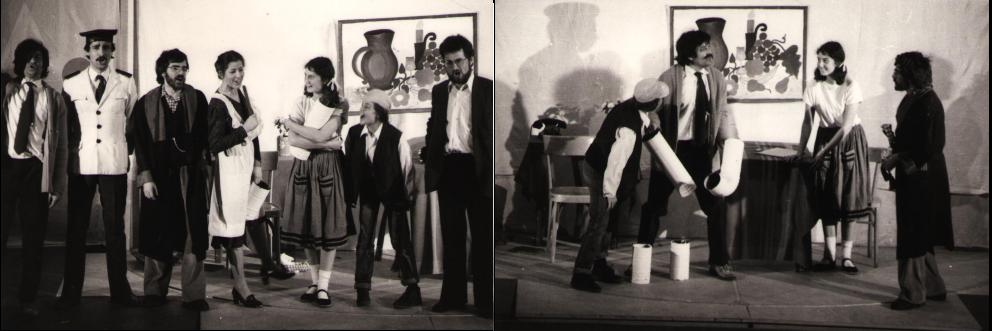

<small>Scenoj el la teatraĵo "Mugnog Kinder"<small>

Dum la tutaj 1980-aj jaroj mi kunlaboris en la amatora teatrogrupo „Theater in der Klemme“ kiel aktoro, scenaranĝisto kaj lumfaranto. La motoro de la grupo estis Franco Marini, kiu estis talenta aktoro kaj entuziasma teatrofaranto. 

Celo de la grupo estis ne nur amuzi la spektantojn sed montri al ili ankaŭ la sozian realaĵon kun ĝiaj problemoj. Tio valoris ne nur por la teatro por plenkreskuloj, sed en aparta maniero ankaŭ por la infanteatro. Tiutempe la infanteatro prezentita de la oficialaj teatroorganizantoj estis plejofte limigata al la prezentado de la tradiciaj rakontoj kiel tiuj de la fratoj Grimm aŭ de H.C. Andersen.
 
Aparte interesaj por ni estis la teatraĵoj de la Berlina teatrogrupo „Grips Theater“, kiuj perfekte kongruis kun la intencoj de nia grupo. Inter alie ni ludis la pecoj „Wasser im Eimer“ (Akvo en sitelo) pri la mediproblemo, „Kannst du zaubern Opa“ (Ĉu vi povas sorĉi avo?) pri la maljunuloj en nia societo kaj "Mugnog Kinder“ (Mugnog infanoj) pri la rajtoj de infanoj. Ni estis konstruintaj transporteblan turn-scenejon kaj prezentis niajn teatraĵojn ne nur en Merano sed ankaŭ en proksimaj vilaĝoj. Ni eĉ registris en televida studio la teatraĵojn „Wasser im Eimer“ kaj „Verbauter Frühling“ kiuj estis prezentataj en loka televidkanalo.

La enspezoj de tiuj televidaj produktadoj estis uzataj nur por aĉeti la bezonatajn materialojn kaj ĉiuj aktoroj kaj la aliaj kunlaborantoj laboris senkoste. Sed ni laboris kun granda entuziasmo kaj ĝojo konvinkitaj ke nia laboro povu kontribui al kresko de la societo.
