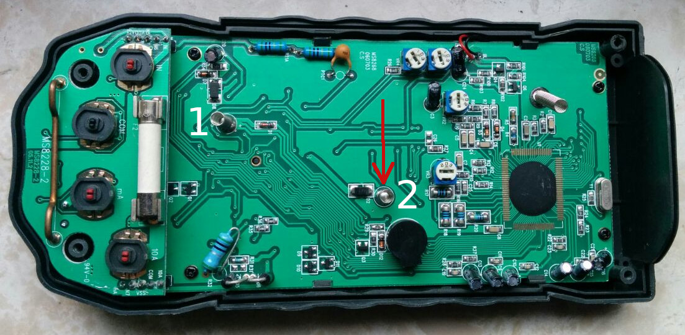

Hieraŭ nia multmetro Mestech-MS8268, post ne esti uzata dum longa tempo, ne funkciis . Premi la butonon "hold" kaj turni la ŝanĝ-ŝaltilon ne helpis, do mi kontrolis la bateriojn. Mi tuj vidis, ke la baterioj estis en malbona stato, vidinte la oksiditan kontakton de unu el ili. 
Bedaŭrinde, la ŝanĝo de la baterioj ne alportis la deziratan rezulton, sed feliĉe en ĉi tiu [video](https://www.youtube.com/watch?v=v8RV3bs1MgQ&t=851s) oni povas vidi ek de la minuto 12:30 kiel malfermi la mezurilon senprobleme. La kontakto inter la baterioj kaj la cirkvito estas farita per du ŝtalrisortoj (1 kaj 2 en la bildo) kaj la kontaktsurfaco de risorto 2 estis forte oksidita. Zorga sablado de la kontaktsurfaco solvis la problemon. 

