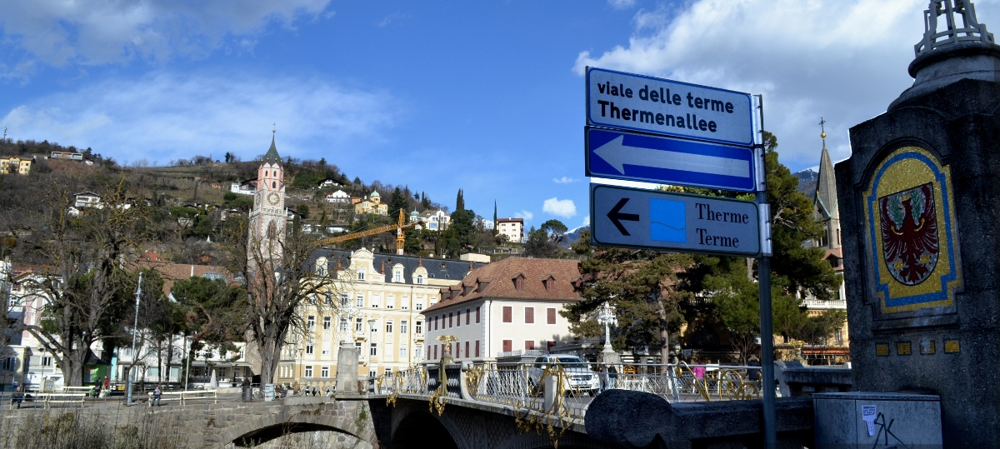

Dal 2006 la cittadina di [Herzberg](https://it.wikipedia.org/wiki/Herzberg_am_Harz) in Germania porta nel suo nome ufficiale l'aggiunta „Esperanto-urbo“. È stato fondato un "Interkultura Centro", l'Esperanto viene insegnato in alcune scuole e usato durante i contatti con la città gemella di [Góra](https://it.wikipedia.org/wiki/G%C3%B3ra).
L'iniziativa é stata accolta con favore in tutto il mondo ed ha portato un pò di fama alla cittadina. Peró secondo me non serve molto per la diffusione dell'Esperanto. Infatti Herzberg é una cittá monolingue e non sente veramente il bisogno di una lingua ponte.

A [Merano](http://it.wikipedia.org/wiki/Merano) invece, la situazione é completamente diversa. Dei 40.000 abitanti circa il 43% appartiene al gruppo etnico tedesco e il 43% a quello italiano. Gli altri o sono ladini, oppure vengono da paesi esteri e parlano lingue del tutto diverse. Nessuna lingua viene compresa perfettamente da tutti, ma tutti conoscono almeno in parte sia l'italiano che il tedesco. Segue, ke la maggioranza dei cittadini di Merano conosce ca l'80% delle radici dell'Esperanto e pertanto la base per imparare la lingua internazionale é ottima.  Inoltre l'introduzione dell'Esperanto come terza lingua nella scuola di base usando il metodo  ["Springboard to languages"](http://www.springboard2languages.org/) potrebbe portare ad un vero plurilinguismo e ad una migliore comprensione tra i gruppi etnici.

Per realizzare questo proggetto e necessario fondare un "Interkultura Centro", che lo accompagna. Questo centro affiliato alla [Libera Università di Bolzano](http://www.unibz.it/it/public/university/default.html) potrebbe diventare un centro internazionale per l'interlinguistica applicata e collaborare con i centri di interlinguistica a Poznan e ad Amsterdam.
