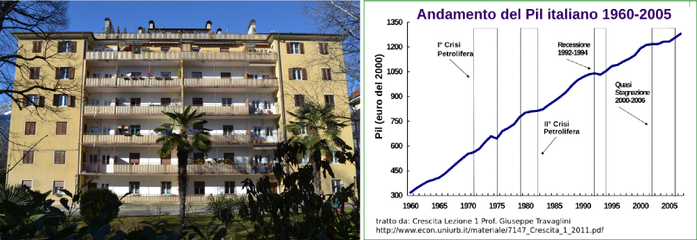

Ricordo bene l'anno 1960. Andavo alle elementari e ho ricevuto una bici usata rimessa quasi a nuovo. Abitavamo in una grande casa sociale con altre 34 famiglie. Nessuno aveva un auto o un televisore, ma da poco avevamo una lavatrice. Nel grande cortile c'era sempre qualcuno con cui giocare e quando ci siamo organizzati riuscivamo a formare due squadre di calcio da undici. Stavo benissimo.

Le [statistiche](http://www.unirc.it/documentazione/materiale_didattico/600_2008_108_3352.pdf) dicono, che da allora il prodotto interno lordo reale (PIL) dell'Italia è aumentato di oltre quattro volte. Si producono cioè quattro volte più beni e servizi, mentre la popolazione è aumentata solo del 20%.  

Se tra la quantità di beni a disposizione e il benessere delle persone ci fosse un nesso diretto, i bambini di oggi dovrebbere stare molto meglio di quanto stavamo noi nel 1960. Sono certo, che non è così. E sono convinto, che anche gli adulti non stanno veramente meglio di allora.

Dalla mia limitata esperienza personale segue, che per un adeguato benessere basta un terzo dei beni che abbiamo a disposizione oggi. Gli altri due terzi li potremmo mettere a disposizione di coloro, che hanno molto meno di quanto avevamo noi nel 1960.  

Questo renderebbe possibile un futuro, nel quale tutti possono stare bene. E nessuno dovrebbe imbarcarsi, per cercare la fortuna dall'altra parte del mediterraneo.