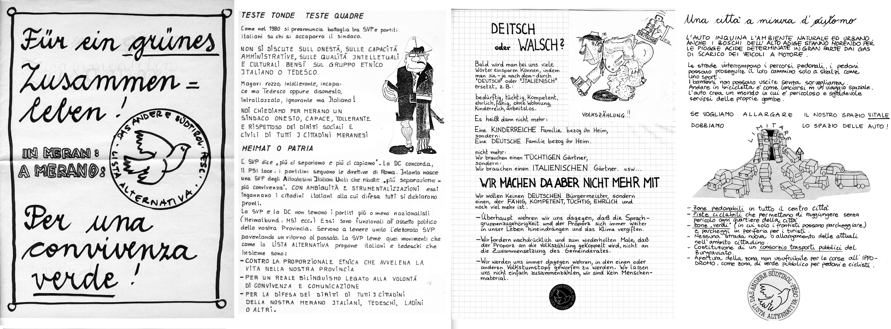

Nel 1985 ci siamo presentati come  **"Lista alternativa per l'altro Sudtirolo"** alle elezioni comunali. Eravamo un gruppo di persone per lo più giovani, che si sono impegnati con entusiasmo. 

Inizialmente sono stati concordati i contenuti del programma e successivamente alcuni dei candidati hanno scritto  e illustrato a mano le singole pagine. 

Il risultato era un piccolo opuscolo, che é stato ciclostilato e distribuito. 

Visto con 30 anni di distanza, trovo interessante non solo questo modo di procedere, ma anche i contenuti di allora, che in buona parte rimangono attuali.

Ecco alcuni esempi.

Sotto il titolo ___"Una città a misura d'automo"___ viene chiesto tra l'altro:   
* *Piste ciclabili che permettono di raggiungere senza pericolo ogni quartiere della città*  
* *Zone "verdi" (in cui solo i frontisti possono parcheggiare) e parcheggi in periferia per i turisti*  
* *Nessuna strada nuova o allargamento delle attuali in ambito cittadino*

Sotto il titolo ***"Giovani? In via d'estinzione"*** si trovano le richieste:    
* *Il nostro traguardo rimane un Centro Giovanile finanziato dal Comune, aperto a tutti i giovani di ogni razza, colore, religione e sprattutto lingua.*  
* *Chiediamo sia introdotta una "tessera di disoccupazione", che permetta a chi ne dispone di avere ingressi ridotti o gratuiti agli impianti pubblici, alle manifestazioni culturali, di avere prezi ridotti sui mezzi di trasporto pubblici e di poter gratuitamente frequentare corsi di aggiornamento professionale.*

Sotto il titolo ***"La guerra è lontana!!?"*** troviamo le proposte:   
* *gemellaggio con una città dell'Est su basi pacifiste*  
* *gemellaggio con una città del 3° mondo e partecipazione a progetti di intervento concreto in questi paesi*  

Chi volesse informarsi meglio sui contenuti di questo programma storico e sapere quali erani le candidate e i candidati può scaricare [tutto il programma in pdf](../../dosieroj/prog85.pdf).
