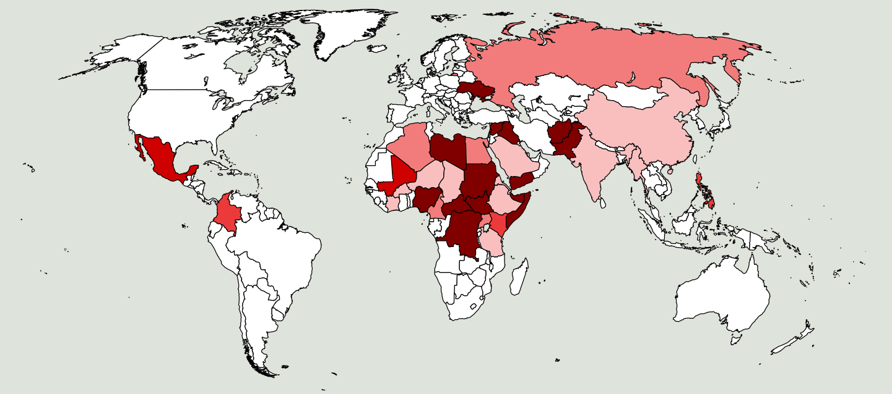

Nella seconda metà degli anni settanta lavoravo come progettista presso una fabbrica di funivie a Vipiteno. Benchè il lavoro fosse molto interessante, desideravo un posto di lavoro più vicino a Merano. Perciò quando in un giornale vidi un annuncio nel quale la ditta IVECO di Bolzano offriva un posto per un ingegenere meccanico, ho presentato domanda di assunzione. Sono stato invitato a fare dei test relativi alle mie capacità tecniche, ho avuto un colloquio con l'ingegnere capo e sono stato accompagnato a visitare i reparti di produzione. Allora mi sono reso conto, che la fabbrica di Bolzano non produceva camion, come avevo pensato, bensì carri blindati destinati agli eserciti. Questo non mi è piaciuto.  Dopo circa una settimana l'ingegnere capo mi ha telefonato, dicendomi che l'azienda era disposta ad assumermi come ingegnere progettista. Ma gli ho detto, che il posto non mi interessava più, perchè non volevo partecipare alla produzione di armi. Infatti già allora ero convinto, che : 

<b>Anche chi produce le armi é colpevole, quando queste uccidono</b> 

 <small>I venti più importanti paesi esportatori di armi</small> 

Nella mappa qui sopra i [venti più importanti paesi esportatori di armi](http://diepresse.com/home/wirtschaft/international/717003/Die-20-grossten-Waffenexporteure-der-Welt) sono colorati in blu. Il colore è tanto più scuro, quanto più grande è il quantitativo di armi esportate per abitante. La seguente mappa mostra i paesi nei quali nell'anno 2014 ci sono stati delle guerre oppure delle violenze armate gravi. Il colore rosso è tanto più scuro, quanto più grande era il numero delle vittime. 

 
<small>Paesi nei quali nel 2014 ci sono stati guerre o gravi violenze armate</small>

La seguente tabella nella parte sinistra  riporta i paesi che nell'anno 2011 hanno esportato più [armi per abitante](https://professorsblogg.files.wordpress.com/2014/05/swe-export-per-capita.png) e il loro prodotto interno lordo (PIL). Nella parte destra della tabella sono riportati i paesi, nei quali nel [2014 ci sono state delle guerre](http://hiik.de/en/downloads/) e il relativo prodotto interno lordo.

|paese esportatore di armi|armi esportate US$/ab|PIL(nom) US$/ab|paese con guerra (2014)|PIL(nom) US$/ab|
|-|-|-|-|-|
|Svezia|73|56900|DR Kongo|150|
|Israele|72|38000|Somalia|240|
|Russia|55|14800|Centr-Afrika Repubblica|400|
|Francia|39|44000|Afganistan|500|
|Svizzera|39|81200|Sud-Sudano|1000|
|Paesi Bassi|32|50400|Jemen|1000|
|USA|32|48400|Nigeria|1600|
|Norvegia|22|99200|Pakistan|2600|
|Spagna|20|32400|Siria|2600|
|Gran Bretagna|17|39200|Irak|3500|
|Italia|17|36300|Ukraina|3900|
|Germania|15|45000|Libia|11000|

Le mappe e la tabella mostrano, che i paesi esportatori di armi non coincidono per nulla con i paesi nei quali accadono le guerre. Mentre i paesi dell' Europa e dell'America del Nord si arrichiscono aumentando il loro prodotto interno lordo con l'esportazione di armi, i paesi più poveri del mondo sono colpiti da guerre e terrorismo. 

Appare chiaro, che la ricchezza dei paesi produttori di armi è resa possibile anche dalla sofferenza delle popolazioni dei paesi poveri, dove le armi vengono usate. 

La riduzione della produzione ed il totale divieto dell'esportazione di armi sarebbero misure necessarie ed un importante contributo alla pace e al giustizia nel mondo. La conseguente piccola riduzione del prodotto interno lordo non ridurebbe il [benessere nei paesi ricchi](http://walter.bernard.im/benessere-non-proporzionale/). La qualità della vita nei paesi poveri aumenterebbe invece in maniera notevole e meno persone sarebbero costrette a fuggire dal proprio paese.
