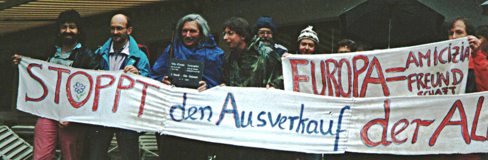
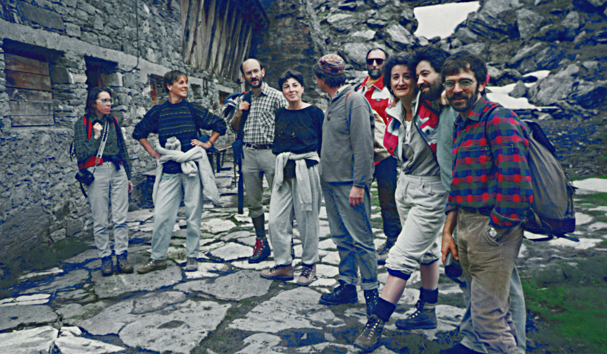
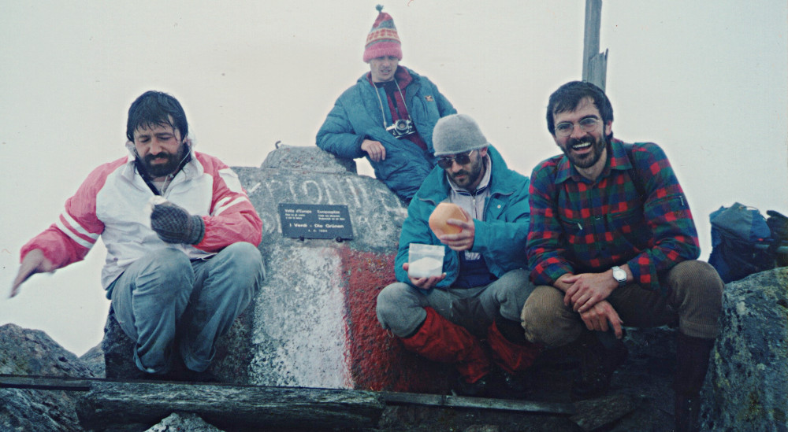

Vent' anni fa è morto [Alex Langer](https://it.wikipedia.org/wiki/Alexander_Langer) pacifista, ambientalista, deputato del consiglio provinciale del Sudtirolo e europarlamentare.

Nel mese di giugno del 1989 Alex organizzò un azione con la quale voleva richiamare l'attenzione sull'importanza della pace tra gli uomini e con la natura.  
Invitò un gruppo di amici e ambientalisti ad una comune scalata della cima più a nord dell'Italia proponendosi due obiettivi: ribattezzare la vetta e lanciare la [dichiarazione a favore delle Alpi](https://riccardodellosbarba.wordpress.com/2011/02/19/vetta-deuropa/).

Infatti il nome della cima era ed è motivo di discussione tra alcuni rappresentanti dei due grandi gruppi etnici del Sudtirolo. Fino alla prima guerra mondiale la provincia fece parte del impero austro-ungarico, la popolazione era quasi tutta di lingua tedesca e il nome della cima era ["Klockerkarkopf"](https://de.wikipedia.org/wiki/Klockerkarkopf). Dal 1918 la provincia appartiene all'Italia e nel periodo fascista è stato adottato il nome  ["Vetta d'Italia"](https://it.wikipedia.org/wiki/Vetta_d%27Italia), che fino ad oggi resta il solo nome ufficiale.

Alex propose di dare un nome nuovo alla vetta. Questo nome doveva essere internazionale e riflettere l'idea di pace e comprensione tra i popoli. Propose perciò il nome "Vetta d'Europa".

Anch'io ho partecipato all'azione e la ricordo volentieri. Ci siamo incontrati una prima volta il 4 giugno 1989 a Kasern, il piccolo villaggio ai piedi della catena montuosa della quale fa parte la vetta. Il tempo non era bello ma pioveva appena un pò e così iniziammo la scalata. Tra i partecipanti c'era anche Karl Bartsch, un ambientalista esperto di botanica, che ci spiegò l'importanza della salvaguardia della flora alpina. Durante l'ascesa il tempo peggiorò e sul sentiero la neve diventava sempre più alta. Quando anche la nebbia cominciò ad infittirsi decidemmo di tornare a valle. A Kasern Alex espose pubblicamente la dichiarazione delle Alpi e si decise una nuova data per il ribattezzamento della vetta. 

Due settimane dopo c'erano le elezioni al parlamento europeo dove Alex fu eletto deputato dei Verdi.

All'inizio di luglio ci incontrammo nuovamente a Kasern. 

<small>Alex Langer (con berretto) in mezzo ad alcuni dei partecipanti che intendevano scalare la vetta all'inizio di luglio.</small>

Anche questa volta il tempo non era bello, ma le nuvole erano abbastanza alte e così iniziammo la scalata. Tra noi c'era anche  [Carlo Alberto Pinelli](http://www.carloalbertopinelli.it/professione.htm) noto regista italiano di film documentari e ambientalista. Quando eravamo già abbastanza vicini alla vetta, il tempo peggiorò ulteriormente e alcuni del gruppo (soprattutto le più prudenti donne) proposero di tornare a valle. Dopo una piccola consultazione Alex decise di accompagnare la gran parte del gruppo a valle, mentre un gruppetto continuò l'ascesa. 

Raggiungemmo la vetta senza problemi e riuscimmo a fissare una targa sulla roccia di cima. Sulla targa c'è scritto: 

###Europaspitze – Friede den Menschen, Bruderschaft mit der Natur – Die Grünen / Vetta d’Europa – Pace tra gli uomini e con la natura – i verdi / 4.6.1989### 

<small>Gruppetto di partecipanti sulla vetta più a nord dell'Italia dopo il montaggio della targa con i nuovi nomi   <bold>"Vetta d'Europa - Europaspitze"</bold></small>

