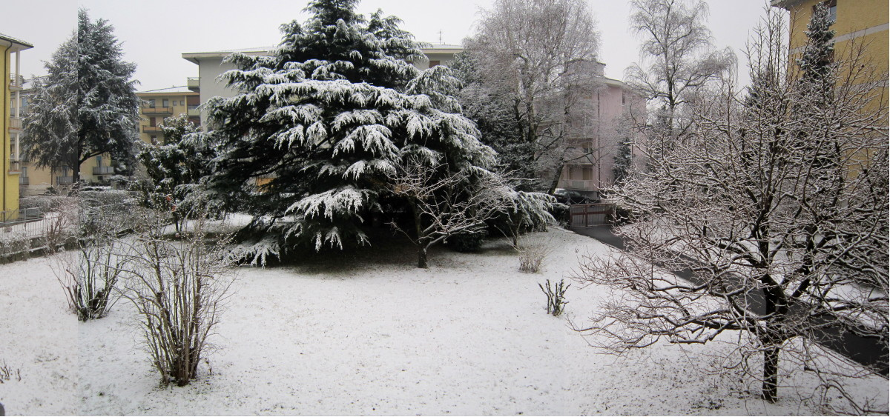

Ieri mattina, vedendo il nostro "parco" coperto da qualche centimetro di neve fresca, ho fatto delle foto pensando che valeva la pena raccontare come è sorto. 

Noi siamo certamente fortunati, perché al giorno d'oggi esistono pochi condomini circondati da un area verde privata così grande. Noi ne abbiamo una sia davanti che dietro la casa. Il motivo di questa situazione favorevole sta nella storia della nostra provincia. 

Per motivi storici la maggior parte degli abitanti della provincia sono di madrelingua tedesca. Durante il fascismo il governo cercò con metodi molto drastici di italianizzare tutti gli abitanti e anche negli anni cinquanta continuò questa politica in modo piú raffinato. Cittadini italiani da altre province venivano invogliati a trasferirsi riservando a loro sia gli impieghi pubblici che le case popolari di nuova costruzione (INA casa). In questo periodo il governo provinciale, guidato dal partito di maggioranza tedesco, aveva acquistato ad un prezzo favorevole un grande terreno per costruirvi appartamenti da destinare ai cittadini, in maggior parte di lingua tedesca (mio nonno era ladino), che erano emigrati durante il fascismo. Ma i soldo bastarono solo per la costruzione di una casa moto grande con 36 appartamenti. In uno di questi appartamenti si é trasferita la mia famiglia (la madre, il padre ed io) di ritorno dall’Austria. L’appartamento aveva solo due stanze, un cucinino e un bagno. Io non avevo un proprio letto. La sera mi addormentavo nel letto dei genitori e quando loro andavano a dormire io venivo trasferito sul divano dell’altra stanza. Quando nel 1957 nacque mio fratello, l’appartamento si faceva veramente stretto.

Per fortuna davanti e di fianco alla casa c’era un grande terreno, dove potevamo giocare e godere la nostra infanzia insieme a molti altri bambini. Inoltre vicino alla casa c’era un frutteto abbandonato di proprietà della provincia dove originamene dovevano essere costruiti ulteriori alloggi per gli emigrati pronti al rimpatrio. Ma il governo provinciale non aveva i necessari mezzi e quindi era disposta a vendere il terreno ad un eventuale cooperativa edile composta da famiglie a basso reddito. Allora le famiglie con basso reddito, che se la sentivano di richiedere un credito in banca per costruirsi la casa erano molto poche, ma i miei genitori erano coraggiosi. Ci volle un po di tempo prima ché la cooperativa raggiunse il minimo di membri necessari (ventiquattro) e solo all'inizio degli anni sessanta iniziò la progettazione e poi la costruzione delle case.

Vennero costruite tre case con otto appartamenti ciascuna e attorno alle case resto talmente tanto terreno, che al giorno d’oggi gli alloggi costruiti sarebbero certamente il triplo. Noi ci siamo trasferiti nella nuova casa nell’estate del 1964 e nei mesi successivi al sabato pomeriggio almeno una persona per famiglia (possibilmente un uomo) doveva partecipare alla sistemazione del terreno attorno alle case, che in parte veniva destinato ad area verde (“parco”) e in parte ad orto. Siccome mio padre doveva lavorare di sabato, io ero l’uomo della famiglia che doveva collaborare e mi ricordo bene, che trasportare terra con la carriola durante tutto il pomeriggio è molto faticoso.  Ma il nostro lavoro non era invano ed il risultato si vede nella foto.