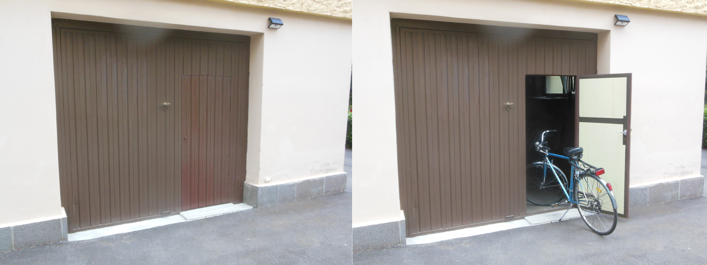

Dum la lastaj semainoj mi estis tre okupita por fine realigi unu de miaj nekutimaj projektoj, kiun mi jam havis en la kapo de kelkaj jaroj. 

Ĉiutage kiam mi iris al la legomĝardeno mi devis malfermi la pordegon de la garaĝo por ŝanĝi miajn ŝuojn kaj por kunporti la necesajn ilojn. 
La pordego estas malnova kaj malfermi ĝin fariĝis ĉiam pli streĉa. Mi provis lubriki ĝin kaj mi ankaŭ ŝanĝis la precipajn boltojn, sed la situacio ne vere pliboniĝis. Tial mi pensis, ke povus esti bona ideo fari malgrandan pordon en la pordego. Per tia pordo eblus eniri kaj enmeti biciklojn en la garaĝo, kaj ĉar ni ja ne havas aŭton, la malfermo de la pordego fariĝus tre malofta.

Mi faris desegnon de la konstruaĵo kaj iris al forĝisto por demandi kiom tia konstruaĵo kostus. Li diris, ke ne vere valoras fari tiun laboro, ĝi kostus minimume 700 eŭrojn, ĝi ne bone funkcius kaj nova pordego kostus nur malmulte pli. Mi tute ne volis forĵeti la malnovan pordegon kaj lasis ripozi la ideon. 

Antaŭ kelkaj monatoj mia frato ŝanĝis la fenestrojn de sia apartamento kaj kiel kutime en nia tempo, la malnovaj fenestroj estis destinitaj al rubaĵo. Ni decidis, ke mi konservu du fenestrojn por eventuale reuzi la glasojn. Antaŭ kelkaj semajnoj, daŭre vidinte la ne uzatajn fenestrojn, ideo saltis en mian kapon. Mi ja povus uzi la lignaĵon de la du fenestroj por fari la kadrojn de pordo en la garaĝpordego. Tion mi faris dum la lastaj semajnoj kaj mi tre kontentas pri la rezulto. Vi mem povas juĝi rigardante la fotojn.