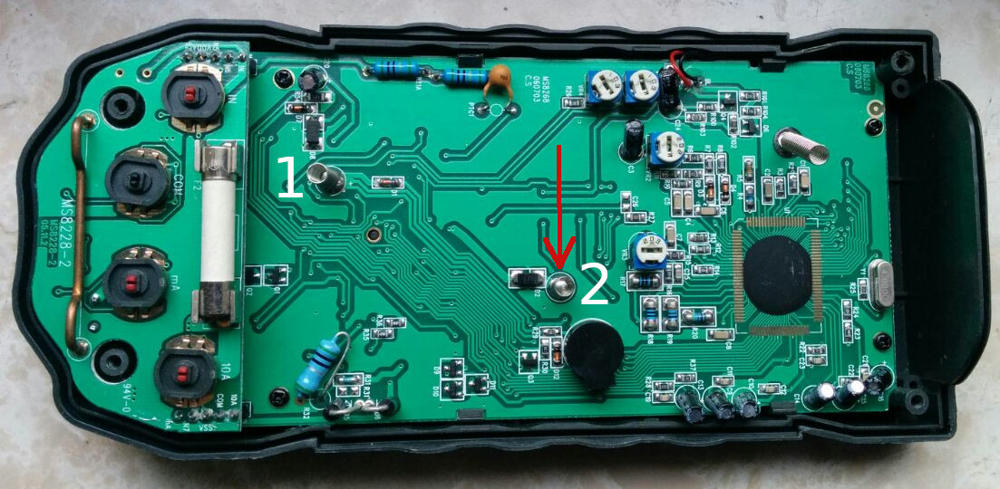

Ieri il nostro multimetro Mestech-MS8268 dopo essere stato inutilizzato per molto tempo non ha più funzionato. Premere il pulsante "hold" e ruotare l'interruttore non ha risolto il problema e quindi ho controllato le batterie. Ho subito notato che erano in cattive condizioni riscontrando il contatto ossidato di una di esse. 
Purtroppo, la sostituzione delle batterie non ha portato il risultato desiderato, ma fortunatamente in questo [video](https://www.youtube.com/watch?v=v8RV3bs1MgQ&t=851s) si può vedere dal minuto 12:30 come aprire il multimetro senza problemi. Il contatto tra le batterie ed il circuito è realizzato con due molle in acciaio (1 e 2 nella foto) e la superficie di contatto della molla 2 era fortemente ossidata. Un'attenta pulizia della molla con carta vetrata ha risolto il problema.

